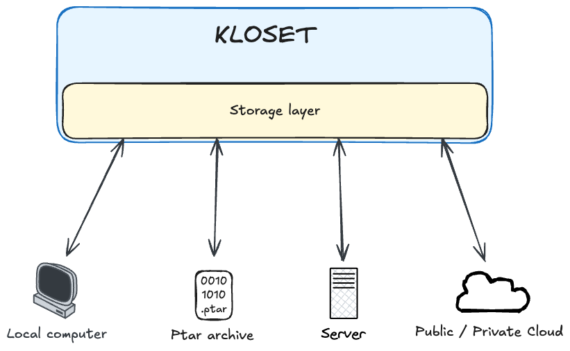
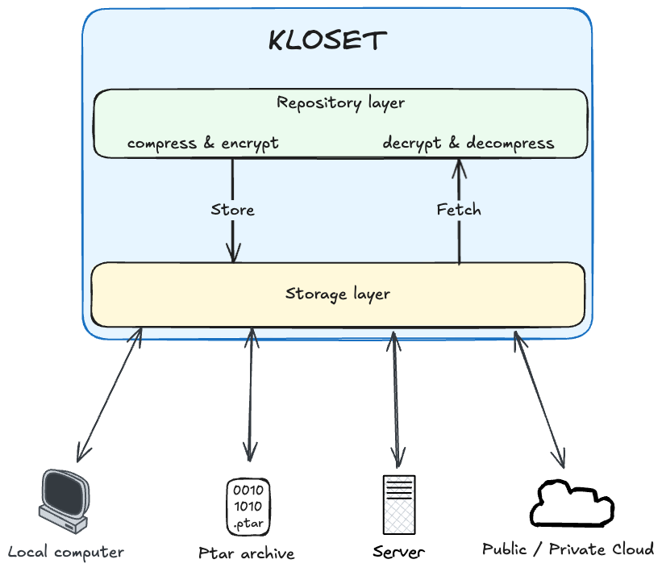
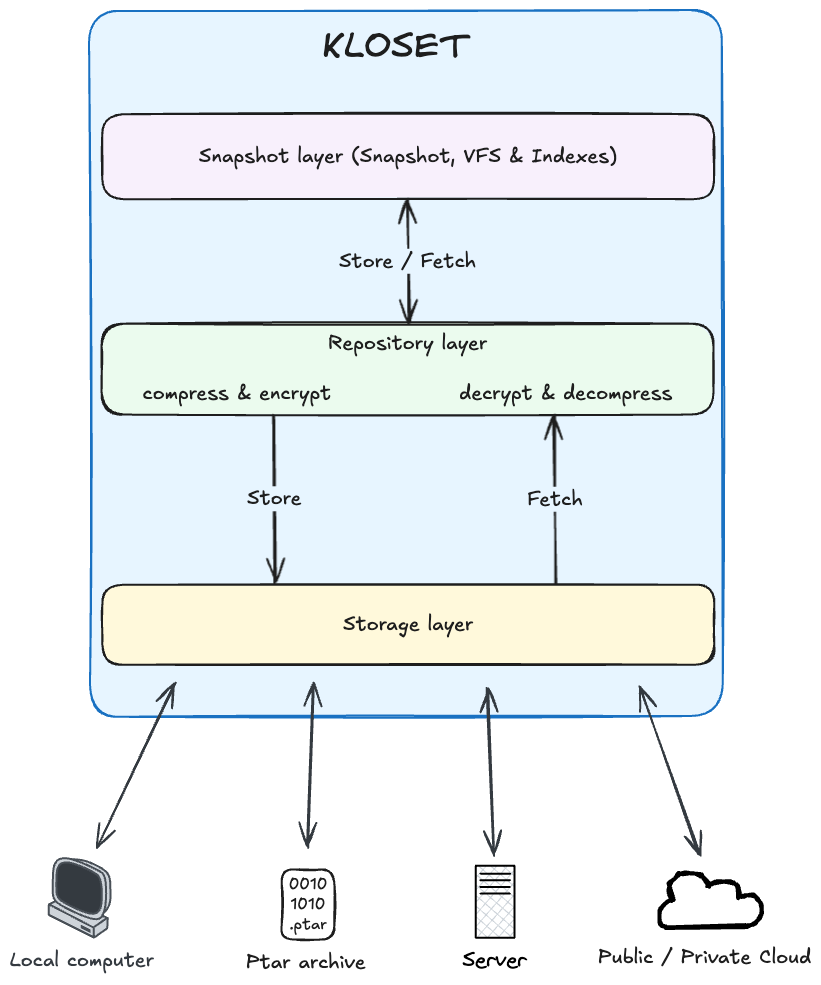

On the surface, `plakar` may appear as just another backup tool: it takes data and safely stores it until restoration is needed—essentially, a sophisticated version of the `cp` command.

Yet beneath this simplicity lies the powerful **Kloset** engine, designed to package data along with its context, structure, metadata, and integrity—much like containers bundle applications with their dependencies. The versatility of **Kloset** allows it to address numerous specialized scenarios:

- Reliable backup and restoration
- Long-term archiving
- Secure log retention for compliance and audits
- Preservation of legal evidence
- Versioning of datasets for machine learning
- Digital authenticity proofs for contracts and media
- Integrity assurance in software supply chains

And likely many other applications waiting to be discovered.

Plakar leverages **Kloset**’s capabilities to create compact, immutable, secure, and transparent backups. It seamlessly integrates with diverse storage solutions including filesystems, databases, object storage, and distributed platforms, without relying on external state or centralized coordination. Our vision: **back up anything, store anywhere, restore everywhere**.

--- 

This post introduces the **Kloset architecture**, explains its design decisions, and outlines how it enables features like incremental backups, versioning, deduplication, granular restores, and verifiable integrity — all with minimal system footprint.

---

> <u>**Key concepts:**</u>
> 
> - Immutable Storage: Data that, once stored, cannot change.
> - Content-Addressable Storage (CAS): Data stored and retrieved by a unique identifier derived from its contents (hash).
> - Virtual Filesystem (VFS): An abstraction representing data in a structured, hierarchical format that mimics a traditional filesystem.

---

## Core Architecture & Principles of Kloset

Kloset was built with a clear set of non-negotiable goals: backups must be **immutable**, **fully encrypted at the source**, **efficient** even at scale or over slow links, **browseable without full restores**, **portable**, and **verifiable** without relying on external metadata.

| console | browser |
|---|---|
|  |  | 

| Feature | Kloset | Rsync | Tarballs | Volume snapshot | opensource competitors |
|---|---|---|---|---|---|
| Immutable Backups | ✅ | ❌ | ❌ | ✅ (limited) |✅ |
| Incremental Efficiency | ✅ | ✅ (suboptimal) | ❌ | ✅ | ✅ |
| Granular Restore | ✅ | ✅ (partial) | ❌ | ✅ (limited) | ✅ |
| Data context | ✅ | ❌ | ❌ | ✅  | ✅ |
| Browseable | ✅ | ✅ | ❌ |  ✅  | ✅ (limited for some) |
| Encryption | ✅ Built-in | ❌ (manual) | ❌ (manual) | ❌ (manual)  | ✅ (limited for some) |
| Self-contained | ✅ | ❌ | ✅ | ❌ | ✅ (limited for some) |
| Data indexing | ✅ | ❌ | ❌ | ❌ | ❌ |
| Typed Snapshots | ✅ | ❌ | ❌ | ❌ | ❌ |
| Archive format | ✅ | ❌ | ✅ | ❌ | ❌ |
| Multi-source | ✅ | ❌ | ❌ | ❌ | ❌ |
| Multi-target | ✅ | ❌ | ❌ | ❌ | ❌ |

Traditional approaches like tarballs, rsync deltas, or volume snapshots couldn't meet these requirements. We needed a model that could, so we chose to represent all data internally as a **virtual filesystem**. It’s a flexible, expressive abstraction that fits any data source — filesystems, databases, APIs — and supports efficient storage, indexing, and recovery.

### Modern Differentiators

Modern backup solutions have improved but often still fall short in areas Kloset addresses directly:

- **Typed Snapshots:** Kloset snapshots can represent different logical types (e.g., filesystems, databases, object stores) rather than just raw files.
- **Portable Archive Format (PTAR):** Export any snapshot, or snapshot collection, as a fully self-contained portable archive for easy distribution, offline storage, or transfer.
- **Built-in Indexing and Analyzing:** Snapshots are natively indexed and searchable; you can query the contents without restoring them first.
- **Multi-source Backups:** A single backup can aggregate data from multiple sources (e.g., local files, S3 buckets, and a Postgres database) into one coherent snapshot.
- **Multi-target Restoration:** Restore one snapshot to multiple destinations simultaneously, with native format translation when necessary.
- **Cryptographic Auditing:** Built-in tamper detection and independent verifiability at every level (chunks, files, metadata).

### Core Model

The idea is simple:

- Read data from any source and map it to a virtual filesystem  
- Store that filesystem efficiently using immutable, content-addressed chunks  
- Later, read it back and export it to any compatible target  

Everything in Kloset is structured around this model, and the system is guided by five key principles:

1. **Immutable Storage**  
   Data is split into deduplicated, compressed, encrypted chunks and stored by content hash. Once written, it’s never modified.

2. **Self-Describing Snapshots**  
   Snapshots include all the metadata needed to understand the structure and context of the backup. They’re portable and browseable without external dependencies.

3. **Pluggable Connectors**  
   Sources and targets are modular. Kloset doesn’t care what it’s backing up — only that the data can be listed and read.

4. **Granular, Stateless Access**  
   You can inspect or restore a specific file or folder without reading the whole backup or loading everything into memory.

5. **Cryptographic Auditability**  
   Each snapshot carries a digest tree for data and metadata, making it independently verifiable and tamper-evident.

This architecture lets Kloset scale from small local backups to massive cloud deployments, all while remaining safe, fast, and flexible.

## Here comes Kloset

Kloset, our immutable data store engine, is in charge of abstracting the problem into smaller problems and providing solutions.

### Storage Layer

At the foundation of **Kloset** is the **storage layer**, responsible for writing and retrieving streams of raw, opaque bytes at specific storage locations. The term *opaque* is important: by the time data reaches this layer, it has already been **compressed and encrypted**, meaning the storage layer has no visibility into its structure or semantics.

Despite this, the storage layer plays a critical role in **organizing opaque data meaningfully and predictably**. It ensures that each stream is stored in a consistent, content-addressed layout, enabling efficient lookup, deduplication, and long-term stability — even without needing to interpret the data.

All data written by Kloset is **strictly immutable**: once a stream is stored, it is never modified. This simplifies concurrency, ensures consistency, and supports optimizations such as caching, multi-writer safety, and low-overhead synchronization.

The storage layer is designed for **scalability and performance**. It is fully **parallelized**, able to handle concurrent reads and writes across multiple streams or backends, and is **backpressure-aware** (adapts to storage speeds to avoid overloading), adapting its behavior to the performance and throughput of the underlying storage system to avoid resource overuse.

Importantly, the storage layer is built on a **pluggable connector model**, allowing it to interface with different backend systems such as filesystems, SFTP servers, or cloud object stores. These connectors abstract the details of connection and data transfer, and will be described in more detail later in this article.

### Repository Layer: Encoding, Decoding And Indexing

Sitting directly above the storage layer is the **repository layer**, a logical component that acts as a **local encoding/decoding proxy** for all data entering or leaving the system.

During a backup operation, data is **not sent directly** to storage. Instead, it flows through the repository layer, which **compresses and encrypts** it locally before passing it to the storage layer for immutable persistence. Similarly, during inspection or restore, data is retrieved through the repository, which **decrypts and decompresses** it before exposing it in cleartext to higher layers.

The repository layer provides a **"local view"** of the stored data—meaning the data is now readable and decoded, but still **unstructured**. For example, file contents and associated metadata may both be available, but the repository doesn’t establish any relationship between them; that responsibility is deferred to higher layers like snapshots or virtual filesystems.

Importantly, the repository layer also maintains a **local index of content already present in storage**. This index allows Kloset to avoid redundant writes and enables **fast existence checks and lookups** without needing to query the underlying storage repeatedly. As a result, most operations—like checking if a chunk is already stored—are handled locally and efficiently.

Because it is built directly on top of the storage layer, the repository **inherits its scalability, performance characteristics, and backpressure-aware behavior**. It can **parallelize encoding and I/O**, adapt to backend throughput, and handle high-volume workloads smoothly. A single repository instance can support **multiple concurrent writers** during backup or **multiple concurrent readers** during inspection and restore.

In essence, the repository is a **stateless, high-performance gateway** between structured user data and raw storage—handling transformation, indexing, and deduplication in a clean, composable layer.

### Snapshot Layer: Structuring Data & Metadata

At the top of the Kloset architecture lies the **snapshot layer**, responsible for giving structure and meaning to the raw data exposed by the repository.

While the repository layer provides access to decoded but unstructured data chunks, the snapshot layer organizes them into **coherent groups of related data** that represent a backup at a specific point in time. Each **snapshot** captures a complete view of a dataset, including:

- Snapshot type (filesystem, database, application, ...)
- Indexing for faster search
- Tree hierarchy for browseable objects, files, directories, ...
- Metadata (timestamps, permissions, ownership, etc.)  
- Content hashes for deduplication and integrity  
- Logical relationships and structure reconstructed from the raw data

Snapshots enable features like **incremental backups**, **change tracking**, and **historical inspection**, by identifying and indexing what has changed between backup operations. They do not modify existing data but instead refer to immutable content already stored in the repository.

By abstracting the low-level details, the snapshot layer makes the data **navigable, queryable, and restorable**, allowing higher-level tools and users to interact with backups in familiar, structured ways—such as restoring a folder or comparing versions of a file.

Internally, the snapshot layer is built on top of a **custom virtual filesystem**, designed to model files, directories, and their relationships in a flexible and efficient way. This virtual filesystem serves as the foundation for snapshot representation and will be discussed in more detail in the following sections.

## Storage bridge: Universal Backend Integration

**Storage connectors** are pluggable components that allow Kloset to interface with a variety of backend storage systems, such as local filesystems, SFTP servers, or S3-compatible object stores.

Each connector is responsible for handling the specifics of connecting to its backend and exposing a minimal, unified interface that supports:
- Listing content  
- Writing data streams  
- Reading partial data from a given offset  

This abstraction enables Kloset to interact with all supported storage backends in a consistent and backend-agnostic way, regardless of the underlying protocols or infrastructure. Since all data at this level is immutable, compressed, and encrypted, connectors operate purely on opaque byte streams—without needing to understand or interpret the data's meaning.

Thanks to this simplicity, implementing a new storage connector can be very lightweight—**a basic connector may require only a few hundred lines of code**, making it easy to extend Kloset’s compatibility with new storage platforms.

## Data bridge: Bridging External Data

**Source** and **target** connectors act as bridges between the external world and Kloset’s internal **snapshot layer**, enabling seamless data ingestion and restoration.

- **Source connectors** are responsible for scanning external data sources—such as filesystems, databases, or remote APIs—to **discover their structure** and **expose their contents** in a readable, consistent format. This allows the snapshot layer to construct a structured, local representation of the source, effectively capturing it as a backup.

- **Target connectors**, in contrast, take a snapshot and **translate it back** into the format expected by the destination system. This might involve reconstructing files and directories on disk, restoring cloud objects, or pushing data into a remote service.

In addition to data transport, connectors also provide a visualization layer, offering intuitive representations of external data. This capability enhances user understanding and simplifies the management of backup and restoration workflows.

Because these connectors operate purely at the **transport level**, they do not need to deal with encoding, encryption, or storage internals. This makes them simple and **lightweight to implement**, often requiring only minimal code to support a new source or target system.

By clearly separating data capture and restoration responsibilities, source and target connectors allow Kloset to integrate with a wide range of systems—handling everything from simple file trees to complex, domain-specific data sources—**without impacting the core snapshot logic**.

## Virtual Filesystem (VFS): Efficient Snapshot Navigation

Kloset includes a custom-built **virtual filesystem (VFS)** that models snapshot data as a structured hierarchy of files and directories. It is designed to implement the semantics of Go’s standard [`fs.FS`](https://pkg.go.dev/io/fs#FS) interface, making it easy to integrate with existing Go tooling and libraries that expect filesystem-like behavior.

Under the hood, the VFS is backed by a **custom B+Tree**, offering efficient, ordered lookups and traversal—ideal for managing large datasets with deep directory structures or for running range-based queries (like path prefix scans or diff operations).

**Key Features**

- **Go `fs.FS` compatibility**: Exposes a familiar and idiomatic interface for navigating and accessing virtual filesystems in Go.
- **Efficient B+Tree backend**: Provides fast insertions, lookups, and ordered traversal, which is essential for snapshot indexing and comparison.
- **Lazy loading & low memory footprint**: The VFS does **not need to reside fully in memory**. Instead, only the portions actively being worked on—such as a directory being browsed or a file being read—are loaded on demand. This design keeps memory usage light, even when handling large or complex snapshots.
- **Immutable view**: Files and directories in the VFS represent snapshot data and are never modified after creation, supporting reliable, consistent access patterns.
- **Portable and stateless**: Being decoupled from the host filesystem, the VFS operates entirely in user space and can be safely used for serialization, inspection, or streaming.

By offering a structured, navigable, and resource-efficient interface to snapshot contents, the VFS forms the backbone of higher-level features like restores, comparisons, and virtual browsing—all without sacrificing performance or portability.

## Advanced Features & Capabilities

### Indexes: Powerful Query & Inspection

While data blocks are being stored, **Kloset simultaneously builds a structured metadata index** that captures everything about the snapshot’s logical content and context. This index is not an afterthought — it is a **first-class citizen** in the architecture, enabling powerful querying, filtering, and introspection.

**What the Metadata Captures**

- **Structure**  
  The complete structure of the dataset — including nested directories, symbolic links, and hard links for filesystems — is recorded in a virtual filesystem model.

- **Application-Specific Context**  
  Source connectors can embed domain-aware metadata (e.g., database schema details, mount point info, or volume names), enabling deep inspection of structured data.

- **Permissions, Timestamps, Ownership**  
  Full POSIX-style metadata is preserved, making it possible to restore not just content, but also its exact execution and access semantics.

- **Tags, Labels, Logical Groupings**  
  Snapshots and their contents can be annotated with logical metadata — including tags, labels, or policy hints — allowing for advanced filtering and lifecycle management:
  organising snapshots per business units, production vs staging, etc...

The metadata engine enables **in-place querying and comparison** of snapshots, without needing to restore or unpack them. Example use cases:

- **Diffing**:  
  _“What changed since snapshot X?”_ — quickly compute file-level or directory-level diffs.

- **Filtering**:  
  _“List all `.sql` files created last week.”_

- **Audit & Forensics**:  
  _“Show me every modified file in `/etc` since Tuesday.”_

- **Restore Planning**:  
  _“Preview only tagged files for restore to a staging environment.”_

Because the metadata engine is tightly integrated with the snapshot and repository layers, all of this functionality comes with **no performance penalty** and requires **no unpacking or external indexing**. It’s ready the moment a snapshot is completed.

### On-Demand Inspection & Granular Restore

Kloset enables **fast, precise, and flexible restoration workflows** by leveraging the same metadata structures and block indices used during backup. Instead of requiring full unpacking or temporary reconstruction of a snapshot, Kloset supports **on-demand access** to exactly the data you need.

**Key Capabilities**

- **Browse Without Restoring**  
  Snapshots can be **navigated like a live filesystem**, thanks to Kloset's virtual filesystem and metadata index. You can explore the full hierarchy, list files, and view metadata **without restoring a single byte of content**.

- **Granular, Targeted Restores**  
  Need just a single database table or config? A file or folder? Content of an S3 object? Kloset allows **partial restores** by streaming **only the minimal required blocks** to reconstruct the requested content — no full snapshot unpacking, no overhead.

- **Format-Agnostic Output**  
  Restored data doesn’t need to return to its original format or location. Kloset supports restoring to **alternative targets**, such as converting a filesystem snapshot to S3 objects, or extracting structured data into a different format. This makes it ideal for cross-system workflows.

- **Dry-Run Support** (coming soon)\
  Before executing a restore, you can **preview exactly what would be restored**, down to individual files and blocks. This makes it easy to validate operations, plan migrations, or inspect backups for completeness without triggering any changes.

By avoiding full snapshot reconstruction and streaming only the required data, Kloset keeps restores **fast, lightweight, and stateless** — whether you're retrieving a single file or rerouting a dataset to a new system.

### Efficient Snapshot Cloning & Synchronization

Kloset supports **efficient snapshot cloning and synchronization** between instances or across storage backends. This functionality is built directly into the engine and is designed to be **deduplication-aware, incremental, and portable**, making it ideal for modern distributed environments.

**Key Features**

- **Deduplication-Aware Sync**  
  During synchronization, only **new or missing blocks** are transferred. Kloset uses content-addressed storage to detect overlap between source and destination, ensuring that redundant data is never copied. This makes cloning **bandwidth-efficient** and highly scalable, even across large or historical datasets.

- **Incremental & Asynchronous**  
  Sync operations work **incrementally**, transferring data in small batches and optionally running **asynchronously** in the background. This allows long-lived sync jobs to resume without starting over, and makes it possible to keep remote instances or backups up to date over time with minimal effort.

- **Networked or Offline Operation**  
  Synchronization can occur **over a network**, or entirely **offline** using portable snapshot bundles. This is particularly useful for disconnected or bandwidth-constrained environments where snapshots are first seeded via physical transfer, then updated later through delta sync.

- **Snapshot-Level Integrity & Reconciliation**  
  Kloset performs **cryptographic reconciliation** during sync, verifying snapshot digests and metadata trees on both sides to ensure consistency. It guarantees that cloned snapshots are **identical in structure and integrity** to the source.

This syncing model unlocks a wide range of real-world scenarios:

- **Edge-to-Core Synchronization**: Push backups from edge devices or remote workers to a central data center or cloud archive.  
- **Multi-Cloud Disaster Recovery**: Replicate snapshots across providers or regions for resilience and failover.  
- **Offline Seeding**: Preload a snapshot in an isolated environment, then reconnect later to sync deltas.

By combining snapshot immutability, content-addressing, and portable metadata, Kloset enables **safe, efficient, and verifiable movement of data** between systems — without relying on fragile heuristics or full re-transfers.

### Built-In Security & Cryptographic Integrity

Kloset is designed with **security as a foundational, non-optional feature**.
Its security layer is **always enabled**, woven directly into the architecture, not layered on top as an afterthought.
Its cryptographic design has been [reviewed by an independant auditor](/docs/audits/) and project is maintained by developers with strong understanding of security concepts.

The system guarantees **confidentiality, integrity, and traceability** for all data at all times — during backup, storage, and restore.

**Key Security Features**

- **End-to-End Encryption (in transit and at rest)**  
  All data is **encrypted at the source** before it ever leaves the client, using modern cryptographic primitives. Data remains encrypted throughout transit and is stored in its encrypted form at rest. No plaintext ever touches the storage backend, and no intermediate component ever sees unencrypted content — not even connectors.

- **Periodic Integrity Verification**  
  Kloset supports **configurable integrity scans**, which re-verify stored chunks against their cryptographic digests. These can be triggered manually, scheduled periodically, or run automatically as part of a maintenance workflow. This ensures long-term consistency and allows early detection of silent corruption or backend issues.

- **Cryptographic Snapshot Manifests**  
  Every snapshot includes a **self-contained manifest** of all its files, directories, metadata, and lineage — cryptographically signed and hashed. This allows Kloset to reconstruct snapshot history, verify parent/child relationships, and detect tampering or unauthorized modifications. Snapshots are cryptographically **provable**.

- **Append-Only Audit Logs** (coming soon)\
  Kloset maintains an **append-only log** of operations, where each action (backup, restore, delete, verify, etc.) is recorded with a **digest that links to previous entries**. This creates a verifiable chain of custody — a tamper-evident audit trail that can be independently inspected and reconciled.

### Built for Compliance

These security properties make Kloset an ideal fit for **regulated environments** where auditability and data protection are mandatory. Snapshots can be stored and restored in a way that satisfies legal and operational requirements under frameworks such as:

- **GDPR** (General Data Protection Regulation)  
- **HIPAA** (Health Insurance Portability and Accountability Act)  
- **NIS2** (EU Network and Information Security Directive)

Because encryption is built-in and metadata is cryptographically verifiable, **compliance is not bolted on — it is enforced by design**. Snapshots can be used as cryptographic proofs of backup validity, integrity, and lineage, making Kloset suitable for organizations with strict governance, forensic, or retention obligations.

### Lightweight & Embeddable by Design

**Kloset** is not a standalone application — it is a **lightweight, embeddable backup engine** designed to be integrated into purpose-built executables such as [`plakar`](https://github.com/PlakarKorp/plakar). Its focus is on **portability, simplicity, and robustness**, making it easy to embed in backup tools, storage utilities, or automation pipelines.

Kloset imposes no runtime requirements and requires no root privileges or external services. It is meant to **run safely and efficiently in user space**, and is optimized for diverse environments, from servers and containers to resource-constrained systems.

## How It Fits Into Plakar

Plakar uses Kloset as its engine — the component that all user-facing commands (via CLI or UI) ultimately call into. Whether you’re triggering a backup, restoring a path, inspecting differences between two versions, or syncing to a remote — it’s Kloset doing the work underneath.

---

## What's Next for Kloset & Plakar?

Kloset is fully integrated into the Plakar beta and will be getting:

- A public plugin SDK (connectors, interpreters, backends)  
- More inspection tools (diffs, browsing, search)  
- Formal spec and manifest format for snapshot interoperability

**Curious about Kloset?**

Explore [Plakar](https://github.com/PlakarKorp/plakar), join our community on [Discord](https://discord.com/invite/uuegtnF2Q5) and start building your own connectors and integrations.