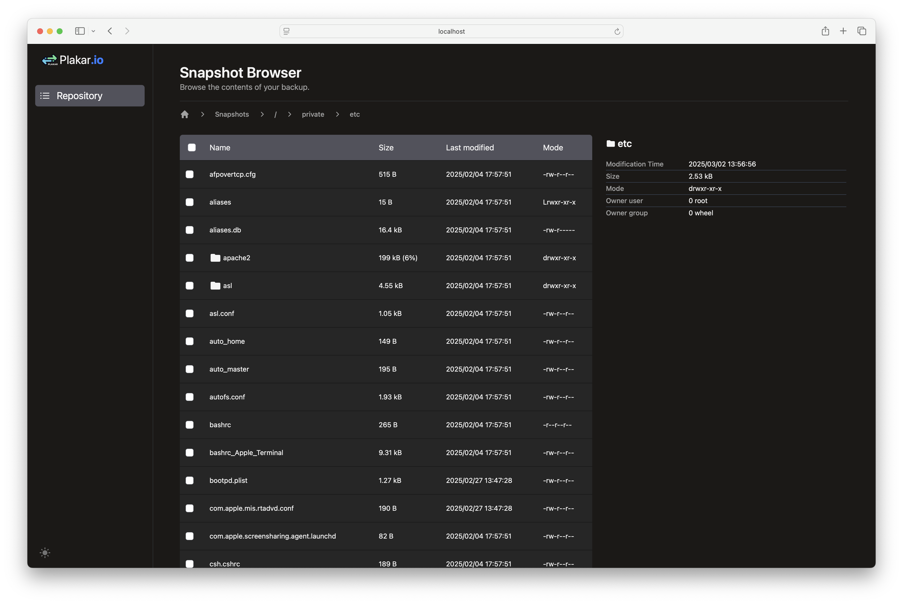

+++
title = "Quickstart"
date = "2025-03-03 17:00:00 +0100"
weight = 1
chapter = false
pre = "<b>1. </b>"
+++

This article will guide you through the creation of your first backup with plakar.

## Installing plakar

{}
At the time of this writing, we do not yet provide packages and **plakar** has to be compiled from source, which requires the Go toolchain to be installed on your system.

To install the Go toolchain, please refer to the [official documentation](https://golang.org/doc/install) or run the following commands:

* **MacOS**: `brew install go`
* **Debian/Ubuntu**: `sudo apt-get update && sudo apt-get install -y ca-certificates golang`
* **OpenBSD**: `doas pkg_add go`

By default, *plakar* is installed in *~/go/bin*. Run `export PATH=$PATH:~/go/bin` to add it to your PATH.

{}

Install **plakar**:

```bash
$ go install github.com/PlakarKorp/plakar/cmd/plakar@latest
```

To verify the installation was successful, run:

```bash
$ plakar version
v1.0.1-beta.13
```

## Running the local agent

To work efficiently,
**plakar** requires each user to run a local agent that will provide caching among other things.
If the agent is not running,
the **plakar** CLI will operate in degraded mode as a safety net,
but will disallow concurrent commands and won't benefit from caching.

Start the agent:
```bash
$ plakar agent
agent started with pid=12539
```

The agent can be stopped with the following command:
```bash
$ plakar agent -stop
```

*If you follow the quickstart but the agent is not running, a warning message will be displayed for each command. You can safely ignore this message: the agent is not mandatory but recommended for optimal performance. This warning can be removed by setting the PLAKAR_AGENTLESS environment variable as such `export PLAKAR_AGENTLESS=`*

## Creating your first local repository


The **plakar** software reads your data,
splits it into smaller chunks that it deduplicates and stores in a **repository**,
a fancy word to designate storage space dedicated to hold these chunks.

A **repository** can be a directory on your local filesystem,
a mountpoint to your NAS,
a remote directory over SFTP,
a bucket on an S3 object store,
or any storage we provide (or you write) a connector for.

Our first repository will be a directory at `/var/backups`:

```bash
$ plakar at /var/backups create
repository passphrase: 
repository passphrase (confirm):
```

{}
Be extra careful when chosing the passphrase:
it is the secret protecting your data.
People with both access to the repository and knowledge of the passphrase can read your backups.

**DO NOT LOSE OR FORGET THE PASSPHRASE:**
it is not stored anywhere and can't be recovered in case of loss.
A lost passphrase means the data within the repository can no longer be recovered.
{}

It is also possible to create unencrypted repositories,
should your backups remain local,
in which case the `-no-encryption` option has to be passed at creation:

```bash
$ plakar at /var/backups create -no-encryption
```

Note that once a repository is created,
it is no longer possible to change its configuration,
such changes require creating a new repository and performing a synchronization between old and new repository.


## Creating your first local backup

Once the repository is created, we can do the first backup to it:

```bash
$ plakar at /var/backups backup /private/etc
9abc3294: OK ✓ /private/etc/ftpusers
9abc3294: OK ✓ /private/etc/asl/com.apple.iokit.power
9abc3294: OK ✓ /private/etc/pam.d/screensaver_new_ctk
[...]
9abc3294: OK ✓ /private/etc/apache2
9abc3294: OK ✓ /private/etc
9abc3294: OK ✓ /private
9abc3294: OK ✓ /
backup: created unsigned snapshot 9abc3294 of size 3.1 MB in 72.55875ms
```

You can verify that it is properly recorded:

```bash
$ plakar at /var/backups ls
2025-02-19T21:38:16Z   9abc3294    3.1 MB      0s   /private/etc
```

Verify the integrity of its content:

```bash
$ plakar at /var/backups check 9abc3294
9abc3294: ✓ /private/etc/afpovertcp.cfg
9abc3294: ✓ /private/etc/apache2/extra/httpd-autoindex.conf
9abc3294: ✓ /private/etc/apache2/extra/httpd-dav.conf
[...]
9abc3294: ✓ /private/etc/xtab
9abc3294: ✓ /private/etc/zshrc
9abc3294: ✓ /private/etc/zshrc_Apple_Terminal
9abc3294: ✓ /private/etc
check: verification of 9abc3294:/private/etc completed successfully
```

And restore it to a local directory:

```bash
$ plakar at /var/backups restore -to /tmp/restore 9abc3294
9abc3294: OK ✓ /private/etc/afpovertcp.cfg
9abc3294: OK ✓ /private/etc/apache2/extra/httpd-autoindex.conf
9abc3294: OK ✓ /private/etc/apache2/extra/httpd-dav.conf
[...]
9abc3294: OK ✓ /private/etc/xtab
9abc3294: OK ✓ /private/etc/zprofile
9abc3294: OK ✓ /private/etc/zshrc
9abc3294: OK ✓ /private/etc/zshrc_Apple_Terminal
restore: restoration of 9abc3294:/private/etc at /tmp/restore completed successfully
$ ls -l /tmp/restore
total 1784
-rw-r--r--@  1 gilles  wheel     515 Feb 19 22:47 afpovertcp.cfg
drwxr-xr-x@  9 gilles  wheel     288 Feb 19 22:47 apache2
drwxr-xr-x@ 16 gilles  wheel     512 Feb 19 22:47 asl
[...]
-rw-r--r--@  1 gilles  wheel       0 Feb 19 22:47 xtab
-r--r--r--@  1 gilles  wheel     255 Feb 19 22:47 zprofile
-r--r--r--@  1 gilles  wheel    3094 Feb 19 22:47 zshrc
-rw-r--r--@  1 gilles  wheel    9335 Feb 19 22:47 zshrc_Apple_Terminal
```

## Viewing the backup with the web interface

Plakar provides a web interface to view the backups and their content. To start the web interface, run:

```bash
$ plakar at /var/backups ui
```

Your default browser will open a new tab. You can navigate through the snapshots, view the files, and restore them.





## Digression: one copy is not enough

You've completed a backup, which is great. However, if you'll allow me, I'd like to digress for a moment:

> Literature and empirical studies suggest that the annual probability of data loss at a single site—especially when considering factors like hardware failures, human error, and environmental risks—is typically in the low single-digit percentages. For example, a seminal study by Pinheiro, Weber, and Barroso (2007) titled ["Failure Trends in a Large Disk Drive Population"](https://static.googleusercontent.com/media/research.google.com/en//archive/disk_failures.pdf) found that hard drive failure rates generally fall in the range of 2% to 4% per year. In practice, when additional risks beyond basic hardware failure (such as accidental deletion or other operational issues) are factored in, many practitioners adopt a conservative estimate of around 5% per year for a single site.

A local backup, as we just did, is helpful in case of accidental removal of the original data...  but not so much if the storage is entirely lost.

As explained in the page [One repository is not enough](/docs/probabilities/), the probability of losing data is as follows:

* For a single set of data: 5% per year (1 in 20 chance)
* For two copies at distinct sites: 0.00069% per year (1 in 145,000 chance)
* For three copies at distinct sites: 0.0000001% per year (1 in a billion chance)

To reduce the risk of data loss, it is highly recommended to create multiple copies of your backups across different locations.

## Creating a second copy over SFTP

We now have a local repository with a copy of our backups, but it is done on the same machine: **we're currently at 5% chances of losing data this year if the drive dies**.

Plakar has been designed to make it easy to synchronize repositories across multiple locations. Let's create another repository on my remote NAS over SFTP and synchronize it with the local one: it should not take more than a couple of minutes.

{}
SFTP is the Secure File Transfer Protocol that comes with OpenSSH.
{}


This can be done by creating a new repository there,
with its own passphrase:

```bash
$ plakar at sftp://gilles@nas.plakar.io/var/backups create
repository passphrase: 
repository passphrase (confirm):
```

We could simply do a new backup to it, but this might produce different snapshots as data may have changed since the first backup.

Instead, we can perform a repository synchronization.

A repository synchronization ensures that backups are transfered from a repository to another, using the recorded data,and performing necessary decryption and encryption to produce a similar copy:

```bash
$ plakar at /var/backups sync to sftp://gilles@nas.plakar.io/var/backups
peer repository passphrase: 
peer repository passphrase (confirm):
sync: synchronized 1 snapshot
info: sync: synchronization from /var/backups to sftp://gilles@nas.plakar.io/var/backups completed: 1 snapshots synchronized
$ plakar at sftp://gilles@nas.plakar.io/var/backups ls
2025-02-19T21:38:16Z   9abc3294    3.1 MB      0s   /private/etc
```

We can verify integrity of the snapshot on the second repository:

```bash
$ plakar at sftp://gilles@nas.plakar.io/var/backups check 9abc3294
9abc3294: ✓ /private/etc/afpovertcp.cfg
9abc3294: ✓ /private/etc/apache2/extra/httpd-autoindex.conf
9abc3294: ✓ /private/etc/apache2/extra/httpd-dav.conf
[...]
9abc3294: ✓ /private/etc/xtab
9abc3294: ✓ /private/etc/zshrc
9abc3294: ✓ /private/etc/zshrc_Apple_Terminal
9abc3294: ✓ /private/etc
check: verification of 9abc3294:/ completed successfully
```

**The probability of losing data this year has now fallen from 5% to 0.00069% (1 in 145,000)!**


## Creating a third copy over S3

But what if both my drive died AND the data center hosting my NAS burst in flames?

Let’s create yet another repository on a remote S3 bucket!

```bash
$ plakar config repository create s3
# for AWS, set s3://s3.<region>.amazonaws.com/<bucket>
$ plakar config repository set s3 location s3://minio.plakar.io:9001/mybackups
$ plakar config repository set s3 passphrase ****************
$ plakar config repository set s3 access_key gilles
$ plakar config repository set s3 secret_access_key ********
$ plakar at @s3 create
```

Let's do another synchronization!

```bash
$ plakar at /var/backups sync to @s3
sync: synchronization from /var/backups to s3://minio.plakar.io:9001/mybackups completed: 1 snapshots synchronized
$ plakar at @s3 ls
2025-02-19T21:38:16Z   9abc3294    3.1 MB      0s   /private/etc
```


We can verify integrity of the snapshot on the third repository:

```bash
$ plakar at @s3 check 9abc3294
9abc3294: ✓ /private/etc/afpovertcp.cfg
9abc3294: ✓ /private/etc/apache2/extra/httpd-autoindex.conf
9abc3294: ✓ /private/etc/apache2/extra/httpd-dav.conf
[...]
9abc3294: ✓ /private/etc/xtab
9abc3294: ✓ /private/etc/zshrc
9abc3294: ✓ /private/etc/zshrc_Apple_Terminal
9abc3294: ✓ /private/etc
check: verification of 9abc3294:/private/etc completed successfully
```

**The probability of losing data has now fallen from 0.00069% to 0.0000001% (1 in a billion)!**


## A few additional words on synchronization

Repository synchronization is slightly more advanced than what was shown,
and you are encouraged to experiment with it to find the best worflow for your use-case.

This first command locates snapshots that exist in my local repository but not in the remote one,
then sends them over:

```bash
$ plakar at /var/backups sync to @s3
```

This second command locates snapshots that exist in the remote repository but not in the local one to bring them over:

```bash
$ plakar at /var/backups sync from @s3
```

And this last command does it both ways, pushing to the remote repositories snapshots that exist locally and are missing, but also fetching locally snapshots that only exist remotely:

```bash
$ plakar at /var/backups sync with @s3
```

In addition, all these commands support passing snapshot identifiers and various options to perform partial synchronizations, only exchanging snapshots that match certain criterias. More information can be found in the [documentation](/docs/commands/sync/).
