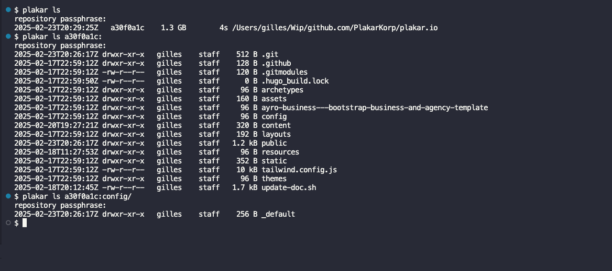
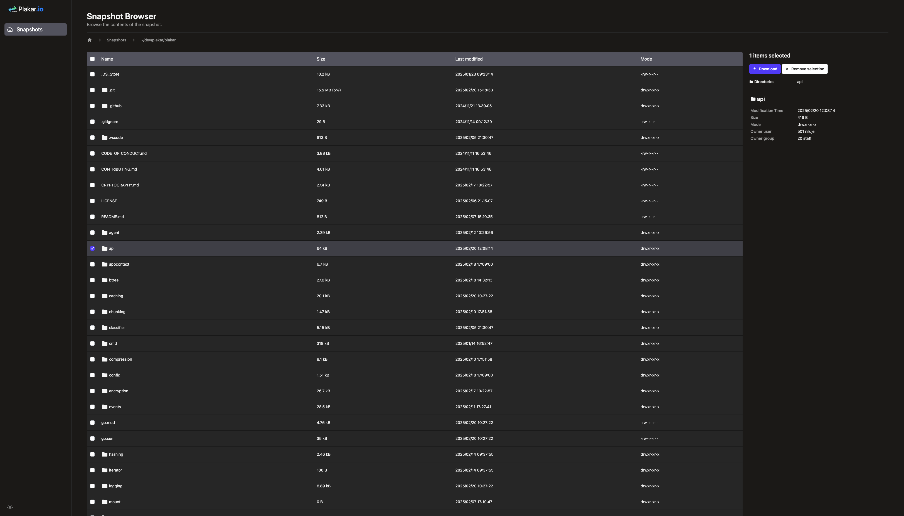

---
**Listen to this article as an AI-generated podcast as you read !**
<center>
    <audio controls>
    <source src="notebooklm.wav" type="audio/wav">
    Your browser does not support the audio element.
    </audio>
</center>

---

Hello!

The past few months have been incredibly intense as we launched Plakar Korp to support the development of `plakar` and other related software.

In just one quarter,
I transitioned from working solo to collaborating with a highly talented team—all of whom I had worked with before in various contexts and knew would be a perfect fit.
Not only did they catch up remarkably fast on the existing codebase,
but each of them also introduced very significant improvements, which is simply astounding to me!

Now that I can delegate even the most intricate code to trusted people,
I figured it was the perfect time to step back from my code editor and write my very first blog post:

**I’m thrilled to announce that our first beta release is now available for general testing, showcasing our current state of work.**


## What is Plakar and why are we doing it?

`plakar` is a free and open-source software for creating distributed and versioned backups of various data sources.
It features data deduplication, compression, and encryption.
Written in Golang, Plakar is developed primarily on macOS, Linux, and OpenBSD.
It is designed to work on most modern Unix-like systems, with a Windows port currently in progress and set to launch soon.

Born out of dissatisfaction with both open-source and commercial alternatives,
Plakar was built with one clear goal in mind:
to provide the most advanced backup features in the easiest form possible.
With no need for hacks or custom scripts, there’s no reason to procrastinate and risk data loss.

It can be installed and configured in seconds:
for most users,
creating a backup is as simple as typing `plakar backup`, and restoring is as straightforward as typing `plakar restore`.
There’s simply no reason to defer setting up backups to the next day!


## What to expect from this beta

Beta software can be worrisome,
so why would you want to try it on a backup software?  

First of all, the storage format stems from years of evolutionary development.
It underwent months of stabilization and stress testing, and it provides various sanity checks to ensure data integrity.
While you may encounter glitches in the CLI or the web UI, which are still fairly recent, the data storage itself is nowhere near beta.
Your backed-up data is stored safely, and data corruptions will not go undetected.  

Secondly, you can test our beta while retaining your existing solution, and then decide if it’s worth switching when our stable release lands.
You’ll be able to evaluate usability, storage efficiency, and see how it improves your workflows and resources usage.

Finally, by testing the beta, you’ll be able to identify commands that need improvement or are missing for your use cases.
This feedback helps ensure that most common use cases are fully supported when the release lands!  

The most likely scenario is that you’ll encounter strange logs, typos in error messages, or command options that do not work as you'd intuitively expect in some cases.
We will fix these issues as quickly as possible.


## State-of-the-art deduplication

To minimize data loss during an incident, it’s crucial to perform backups frequently so that the gap between the last backup and the incident is as short as possible.

However, backups involve reading data, processing it, and transmitting/writing it to storage, so the frequency of backups is limited by available resources.
For example, if a backup operation takes over an hour, you can’t realistically schedule hourly backups.
Similarly, if you have 1TB of storage for backing up 100GB of data, the number of backups you can store depends on how efficiently each backup uses space—essentially, on how well it avoids storing redundant data.

Inefficient deduplication can lead to data being read, transmitted, and stored more times than necessary.
This not only slows down the backup process but also consumes additional bandwidth and storage space, driving up overall costs.
The problem is compounded in a 3-2-1 strategy, where multiple copies across different sites can significantly amplify these inefficiencies.

Historically, backup systems relied on making full copies of the original data.
Over time, incremental backups were introduced to store only newly created or modified files.
Later, the approach evolved into fixed-sized chunking, which enabled the transmission of just the modified parts of a file—provided its structure remained unchanged.
Today, the most advanced method is content-defined chunking, which intelligently divides files into chunks and adapts to shifts caused by data insertions or deletions, ensuring that only the smallest possible delta is transmitted.

Plakar builds upon our [go-cdc-chunkers](https://github.com/PlakarKorp/go-cdc-chunkers) package, which implements state-of-the-art content-defined chunking algorithms.
In our benchmarks with similar random data, our implementations not only outperformed all others by a fair margin but also provided an excellent distribution of chunk sizes:

```tt
Benchmark_Restic_Rabin_Next-8              613.78 MB/s    1301 chunks
Benchmark_Askeladdk_FastCDC_Copy-8        2091.00 MB/s  105327 chunks
Benchmark_Jotfs_FastCDC_Next-8            2473.86 MB/s    1725 chunks
Benchmark_Tigerwill90_FastCDC_Split-8     3112.39 MB/s    2013 chunks
Benchmark_Mhofmann_FastCDC_Next-8         2078.19 MB/s    1718 chunks

Benchmark_PlakarKorp_FastCDC_Copy-8       7733.47 MB/s    3647 chunks
Benchmark_PlakarKorp_FastCDC_Split-8      8142.45 MB/s    3647 chunks
Benchmark_PlakarKorp_FastCDC_Next-8       8149.54 MB/s    3647 chunks
Benchmark_PlakarKorp_JC_Copy-8           13431.34 MB/s    4033 chunks
Benchmark_PlakarKorp_JC_Split-8          13734.42 MB/s    4033 chunks
Benchmark_PlakarKorp_JC_Next-8           13739.79 MB/s    4033 chunks
```

Github user [@glycerine](https://github.com/glycerine) performed independent benchmarks,
testing other algorithms such as Google's FastCDC implementation for Stadia,
[which we also outperformed](https://github.com/PlakarKorp/go-cdc-chunkers/pull/5#issuecomment-2614533912).

We will continue to track advances in the field to implement state-of-the-art algorithms and provide our users with the best deduplication they can expect.


## State-of-the-art encryption

Backups often reside in cloud services or offsite storage, which might be targeted by hackers or even vulnerable to insider threats.
Attackers might attempt to steal data and silently modify or delete backups without detection.

To limit these risks, the only solution is to rely on end-to-end encryption (E2EE) and message authentication codes (MAC) to provide privacy, authenticity, and integrity guarantees.

E2EE encrypts data locally before it leaves your device, ensuring that only you can decrypt and read it — even your storage provider cannot access the information.
This protects your data from unauthorized access throughout its lifecycle, from creation to retrieval, even if the storage system is compromised or physical disks are stolen.

MAC enable detection of any unauthorized modifications to the data, ensuring that any attempt to alter or tamper with your backups is promptly identified.

> Security is a process, not a product.\
> – Bruce Schneier

Cryptography was not built as an add-on feature layered on top of `plakar` but is an integral part of its design.

It relies heavily on MAC to authenticate any information stored as part of a backup,
performs encryption during backup and decryption during restore without ever sharing the secret with the storage layer.
It effectively performs end-to-end encryption, allowing the hosting of repositories at public cloud providers: a backup repository does not leak information regarding its content, and any tampering is detected and reported during backup checks or restore.

In the sample below,
I blindly modified a random byte in the backup repository which tampered with a random file,
and performed a check on the backup:

```
$ plakar check ec6f019c        
repository passphrase: 
ec6f019c: ✓ /private/etc/afpovertcp.cfg
ec6f019c: ✓ /private/etc/apache2/extra/httpd-autoindex.conf
ec6f019c: ✓ /private/etc/apache2/extra/httpd-dav.conf
ec6f019c: ✓ /private/etc/apache2/extra/httpd-default.conf
ec6f019c: ✓ /private/etc/apache2/extra/httpd-info.conf

[...]

ec6f019c: ✘ 43650d9f7...: corrupted object
ec6f019c: ✘ /private/etc/openldap/schema/java.schema: corrupted file

[...]

ec6f019c: ✓ /private/etc/zshrc
ec6f019c: ✓ /private/etc/zshrc_Apple_Terminal
ec6f019c: ✓ /private/etc
ec6f019c: ✓ /private
ec6f019c: ✓ /
```

Despite having a good internal understanding of what we’re doing,
we decided to contract a cryptographer to perform an independent review and provide suggestions for improvements.
The [audit](/docs/audits) confirmed that our design is sound and provided suggestions,
all of which were implemented,
to strengthen our approach further and make `plakar` future-proof from a cryptographic standpoint.

We will commit to relying on independent reviews from cryptography experts and follow their guidance whenever working on cryptography-related topics, including reassessing previous decisions at regular intervals to ensure we remain ahead of evolving attacks.


## A few words on performances

When evaluating the performance of backup software,
we need to consider multiple dimensions that together provide a proper balance between scalability,
resource utilization,
and speed.

Our challenge is to identify the optimal tradeoffs so that you achieve maximum scalability and speed while using minimal resources.


### Scalability

As data grows,
both in terms of size and number of objects,
challenges arise:
how does a solution cope with millions of objects,
or even,
how does it handle millions of objects in a single directory?

When I first discussed this with [@misterflop](https://github.com/misterflop),
he installed a widely-used commercial software to test these worst-case scenarios, and it crashed on him at the first try.

The same test on `plakar` succeeded but back then,
as was common with other open-source solutions,
it used in-memory structures that made it super fast—but also caused it to consume huge amounts of memory in such cases, exposing it to OOM kills.
After weeks of byte-level optimizing it became clear that none of the few bytes saved here and there would enable scaling significantly.

We decided to implement two major changes:
first, to start relying on disk offloading during backups to avoid hogging all memory;
and second, to structure snapshots as a B+ tree, which allows us to spread nodes across our storage and load them on demand rather than forcing entire indexes to fit in memory.

The two changes required considerable work but eventually paid off and while offloading to disk cost us roughly a 30% penalty in backup speed,
`plakar` can now scale to very large backups without requiring insane amounts of memory.
We can now put some focus on optimizing speed knowing that scalability is a solved issue !


### Deduplication efficiency

While it is difficult to produce universal metrics—since efficiency depends on the type of data being backed up and its variability over time—we can affirm that `plakar` is highly efficient in deduplication.

By combining efficient compression with state-of-the-art content-defined chunking deduplication, the first backup is generally slightly smaller than the original data, and subsequent backups are considerably smaller as they essentially consist of the delta.


In the example below,
I backed up our korpus folder ten times producing snapshots of 33GB each.
The repository holds 327GB of cumulative data,
however the actual repository size is only 28G which is smaller than even a single snapshot by over 15%.

```ttt
$ plakar info |grep ^Size
repository passphrase: 
Size: 327 GB (326968934310 bytes)

$ du -sh ~/.plakar       
28G    /Users/gilles/.plakar
```

A 100GB directory can be backed up dozens of times in a day while the repository grows by only a few MB if changes are limited.

Thanks to this robust deduplication, use cases where frequent backups were previously unrealistic due to wasted space—or where offsite backups were prohibitively expensive because of the storage required for multiple copies—are now viable again.


### Speed

While our initial focus was on ensuring every backup is robust and error-free,
early benchmarks indicate that our solution performs fairly well even with these priorities...
but we can do better because fairly well is not enough:

Our goal is to offer the best of both worlds—robust data integrity and exceptional speed. 

#### The road ahead

We plan to streamline backup and restore processes by refining our algorithms,
leveraging more parallel processing,
and reducing any unnecessary overhead and locking.
We also plan to improve caching mechanisms and fine-tuning resource allocation,
aiming at a boost of performance while keeping resources consumption minimal.

These are all fancy words to say: we plan for faster backups and recoveries.

The foundations we’ve laid for correctness and scalability create a strong baseline upon which we can continuously optimize performance.
As we incorporate these enhancements and you update to newer versions,
you can expect even shorter backup and recovery windows.

This is not just claims:
in prototypes with basic parallelization optimizations,
integrity checks of backups obtain up to a x10 boost and restore obtains up to a x4 boost...
and these are with naive optimizations.


## A few words on reliability

It is impossible to guarantee that backups are never corrupted,
because storage failures and bugs are bound to happen.
However,
we should make sure that backups do not produce corrupted data,
and that data corruption happening in the storage do not go undetected.

### Deferred garbage collection

`plakar` operations are non-destructive by design:
clients push new states that are aggregated to previous states,
even the deletion of a snapshot is technically the addition of a deletion event.

A maintenance job can be scheduled at frequent intervals to reclaim storage space by removing resources that are no longer referenced by a snapshot.
Lots of effort has been poured into making this process lock-less and allow maintenance to happen in parallel to backups in progress.
However,
because this is the only destructive operation in a backup repository,
we decided to take two safety net measures during the beta phase:

1. maintenance locking:
despite the maintenance being lock-less,
we are temporarily resorting to a maintenance lock preventing maintenance to happen in parallel to backups in progress.
The goal is to prevent users from having to deal with corner-cases that we're unaware of and that we'll try to provoke through stress-testing.
When we're 100% confident,
the locking can transparently go away in a new version.

1. deferred garbage collection: orphaned resources are marked as deleted but are only deleted after a grace period.
During that grace period,
`plakar` will fail lookups as if the resources had been removed for real and display an error message... while keeping them at hands should a bug have creeped in.
If the error message is never encountered in the next few weeks or months,
this deferred garbage collection can transparently go away in a new version.


### Test Coverage

Because recent `plakar` development happened at a fast pace, we prioritized writing tests for the most critical components that could lead to data corruption.
All of the lower layers, from storage to encryption, have unit tests integrated into our CI, which prevents code merges if a test fails.

Work is in progress to continuously improve testing even for the upper layers, such as the CLI and subcommands, even though these components carry minimal risk of causing data corruption.


### The plakar Korpus

We compiled a corpus of millions of objects, including text, code, binary objects, and images coming from popular code repositories.
`plakar` is tested by performing backups of this corpus,
then running integrity checks and restores,
none of which are supposed to ever fail regardless of how many times they are ran.

While this corpus is representative of the wide variety of data people tend to back up,
it is a worst-case scenario since it contains a LOT of heterogeneous data in a single backup,
making it very likely to be worse than your typical use-cases.

### Integrity Validation

When creating backups, `plakar` computes a cryptographic MAC for every chunk of data as well as for entire objects.
These MACs are recorded in the snapshot and used as lookup keys in the backup repository.

This mechanism allows it to easily validate that the stored data has not been corrupted by fetching the data and recomputing the MAC to compare it with the recorded value.
This process is used during a restore, as each file has its chunks recomputed to ensure they match the records when writing back the files to a target.

Additionally, `plakar` provides a check mechanism to perform these operations without executing a full restore, allowing, for example, a laptop with 256GB of disk space to verify the integrity of a 1TB backup.


### Structures Versioning

`plakar` incorporates versioning for all its internal structures that interface with storage.

This approach ensures that sanity checks can be performed, prevents older versions from manipulating data created by newer versions, and allows new versions to reload data created by older ones.

More generally, it enables deduplication across different versions in use without risking corruption from misinterpreting the stored structure format.


## Now about features in this beta!

The beta comes after years of late-night development and a quarter of intense full-time teamwork.

It is difficult to list exhaustively all the features it brings, so let’s focus on the most notable ones and let you discover everything it has to offer by testing it!


### Extensive Built-in Documentation

Following the Unix tradition of providing manual pages for all commands, `plakar` offers manual pages for each of its subcommands, detailing their options and usage examples.


These manuals are available online and can also be accessed offline directly from the tool, ensuring you have the necessary information during an incident when internet access may be unavailable.
The online documentation is synchronized with the tool's documentation to guarantee that they are always identical and that any fixes are updated everywhere.

There are few things as frustrating as inaccurate or missing documentation in the middle of a stressful incident—especially when it involves potential data loss.
We consider such documentation issues as critical bugs that must be fixed with the same urgency as any software defect.


### A unix-friendly CLI
Plakar has no learning curve: it mimics existing Unix-like commands to feel natural.

You’ll be able to run commands like `plakar backup`, `plakar restore`, `plakar cat`, `plakar ls`, `plakar diff`, `plakar locate`, or even `plakar rm`, so that in the event of an incident requiring fast actions you don’t need to re-discover the command line of an unfamiliar tool.



Once the backup repository is setup,
manipulating backups becomes as natural as an everyday task.


### A user-friendly web UI
It comes with a user-friendly web UI that lets you browse, preview, and download content.

Light mode             | Dark mode
:-------------------------:|:-------------------------:
 |  

Over time, the web UI will progressively support all the features available in the CLI, giving users the flexibility to work in either the console or in a browser.


### Multi-backend storage layer
Plakar supports storing backups using a variety of backends.

It can store backups on a local or mounted filesystem,
on a remote filesystem via SFTP,
in an S3 bucket powered by MinIO, Vultr, Scaleway, or AWS,
and even offers experimental support for databases with SQLite.

We will continue implementing new backends to expand the variety of storage solutions available to `plakar` users.


### Multi-backend importer and exporter layer
Unlike many other solutions,
`plakar` does not focus on a single type of data source.

It provides an API to implement data importers and exporters,
enabling it to back up data from remote sources—such as an S3 bucket—and restore them to a remote target,
like a different S3 bucket,
or a local directory as importers and exporters are not tied one to another and allow mixing.

Just as with storage backends,
new ones will be implemented,
allowing `plakar` to back up more than just local filesystems while retaining the same intuitive feel and benefit from the same level of deduplication and encryption.


### Cross-site synchronization
Backup repositories can be synchronized with each other in either direction.

The synchronization mechanism is designed to be both flexible and secure, allowing administrators to configure bidirectional replication that maintains consistent data across multiple sites.
Whether you need to mirror backups for disaster recovery or adhere to regulatory constraints that dictate specific data flow directions, `plakar` adapts to your requirements.

The system optimizes data transfers by propagating only incremental changes, ensuring efficient use of bandwidth while keeping repositories in sync.


### Agent mode
It also comes with an experimental agent mode,
which allows basic orchestration and scheduling of tasks in a simple infrastructure.

The agent mode can be used to configure specific tasks and ensure they run at given intervals,
removing the need for scripting tools to control `plakar`.

---
## Want to give it a try ?

You can install and test `plakar` right away following these simple two steps:

1. Read the simple [Quickstart guide](https://docs.plakar.io/en/quickstart) that will hold your hand and help you get started
2. that's all actually, no need for more :-)


---

## Want to help us ?

The best way to help us is to test `plakar`, report any issues you encounter so that we can improve and polish the software before the stable release, and contribute to both the documentation and code if that's within your skillset.
By testing `plakar`, you play a crucial role in enhancing its stability and usability, as each bug report, suggestion, or enhancement helps us refine the product and better meet the needs of our community.

The next best way to support us is to spread the word and share this post with your friends.
Word of mouth is essential for us at this point to gain traction and popularity, as every recommendation helps build a community of engaged users invested in the project's success.

Finally, feel free to join our [Discord](https://discord.com/invite/uuegtnF2Q5) server, where development takes place almost transparently every weekday (and sometimes in the evenings for night owls).
There, you can chat with our community, ask both general and technical questions, and observe discussions among developers in our virtual hackrooms.
You might even catch parts of our technical meetings in public vocal rooms, providing you with unique insights into our development process.

Together, these actions—testing, sharing, and engaging—are the pillars that help `plakar` evolve into a robust and user-friendly tool for everyone.

---

## What's coming next ?

### Bug fixing

We intend to squash all "blocker" bugs reported to us in preparation for an upcoming Release Candidate version.
This Release Candidate will pave the way for our first stable release.


### Optimizations

First of all, we have several parallelization optimizations that we did not include initially because we focused on correctness over raw performance.
Our next phase is to start parallelizing commands that are currently running sequentially.

In addition, we have identified several areas that require in-depth optimization, such as refining the unlocking process of our B+ tree and better caching.


### Alerting, monitoring and dashboards

We want to add support for a few features for registered users,
such as availability of analytic dashboards,
monitoring of backups and alerting should backups, check or synchronization of repositories do not happen at the expected intervals or fail for any reason.
We are still assessing the best way to provide these features while retaining the expected privacy.


### Amazon S3 Glacier

We also want to add support for Amazon S3 Glacier to provide at least one service with Write-Once-Read-Many (WORM) capabilities.

This will allow users to push their backups into tamper-proof storage, ensuring that once data is written, it cannot be modified.


### More importers !

We want more importers to ingest data from new data sources,
and we already have ideas how to move forward with this to provide the most popular ones in a relatively short timeframe...
but at this point no spoil !


### Enterprise version

When the RC is released,
our team will split so that we always have people focusing on the community version,
and people working on the enterprise features that will complement it.

The enterprise version will provide all the features that dont make sense to most users for small setups,
but that companies rely upon for accountability, regulatory requirements or simply convenience when dealing with a large number of servers.
