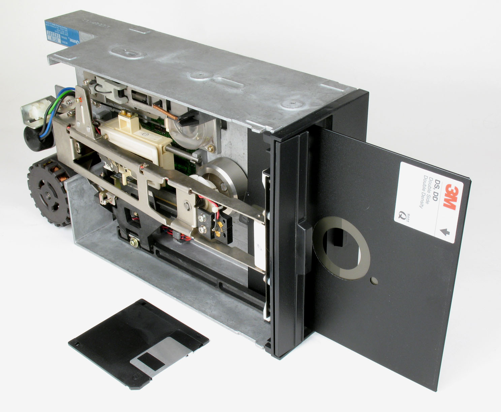
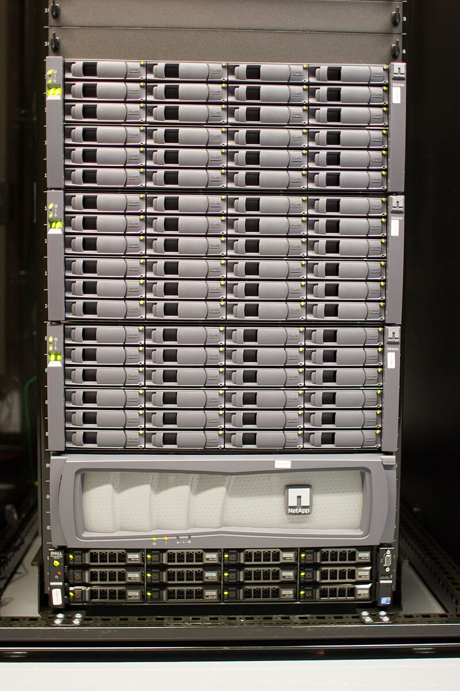
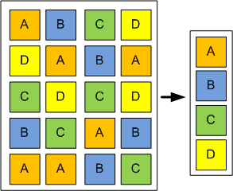
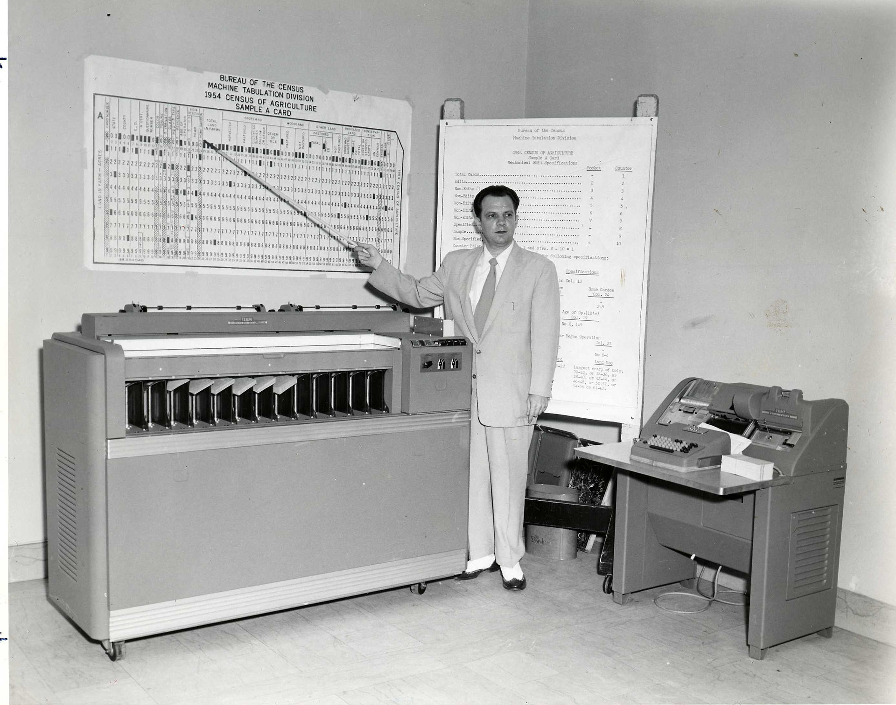

## In honor of World Backup Day – March 31

March 31 is World Backup Day a global reminder that your data isn't immortal, your hard drive will eventually die, and “I thought I saved it” isn't a recovery strategy.

And no your photos aren’t actually backed up on iCloud; they're just synced. Google and Microsoft don’t truly back up your emails; that's your responsibility. Slack can and will lose your precious conversations, and yes, even your fancy S3 buckets can vanish because a cloud admin clicked the wrong button (trust me, it happens more often than you'd like). Remember, the Cloud is just someone else's computer managed by someone who hasn't had their coffee yet.

So today, let’s raise a toast to the unsung hero of the digital world: the quiet one, the awkward one the one that never gets a thank you unless something crashes. And if you don’t have a backup to toast with, spare a thought for those colleagues you really don’t want to organize a farewell party for after the next ransomware attack or the inevitable human error (even though you enabled versioning on S3).

Let's explore how backups evolved from panic-driven memory dumps to intelligent, queryable snapshots and perhaps you'll finally see backups as your new best friend, not just a grudging necessity.

## The 1950s to 1970s: Brute-force survival

Welcome to the era of mainframes, magnetic tapes, and IBM engineers who backed up data as if it was a military drill because it practically was.

No folders, no files, no undo buttons. Backup meant dumping every single bit of memory or disk onto tapes using tools like `dd`, `tar`, or `cpio`. There was no "restore document" option your recovery plan was reloading everything, slowly, manually, and with all the grace of a brick falling from the sky.

It wasn't elegant, but it worked. Mostly.

Think of it as photocopying your entire house just to preserve the bathroom.

## The 1980s and 1990s: Archives you could carry

Then came personal computers and the sweet agony of limited floppy disk space (remember those 1.44MB disks?). Compression became essential, giving us ZIP, RAR, and ARJ. Suddenly backups weren't just about survival; they were portable.

People didn't just back up they zipped, emailed, shared, hid, and labeled archives as "homework_final_FINAL.zip." But restoration? Let's be honest it wasn’t a priority. The internet was still dial-up and barely critical, so who cared if restoration was fragile? Your backups fit in your backpack, and that was cool enough.

Backups felt personal. Restoring? Meh, tomorrow’s problem. Honestly, we spent more time choosing funny filenames than worrying if we could ever open them again.

## Late 1990s to mid-2000s: Incrementals, deduplication, and system clones

As IT expanded, backups matured rapidly. Incremental backups emerged, making nightly backups manageable without drowning in tapes. Hardware deduplication dramatically reduced storage costs, with Data Domain appliances becoming overnight stars, giving IT managers new hope.

Simultaneously, system cloning revolutionized disaster recovery. Tools like Norton Ghost, Acronis True Image, and Apple's Time Machine enabled quick, bootable restorations. Time Machine even made backups stylish, letting users flip through past states as if browsing Netflix. Finally, backups had better user interfaces than most corporate websites at the time.

Yet, these backups were still tied closely to their environments you couldn't peek inside without restoring first.

## 2005 to today: Smarter, safer, and open (thanks, ransomware!)

Because nothing says ‘Happy Monday’ like an encrypted hard drive and a Bitcoin ransom note.

Enter the open-source backup revolution: Borg, Restic, Duplicity, Tarsnap and Kopia stepped onto the scene. Incremental snapshots became standard, finally burying full backups. Deduplication and encryption weren't optional they became essential, driven largely by escalating ransomware threats.

Legacy backup solutions scrambled to add encryption at rest and in transit, but bolting on security didn't overcome fundamentally outdated designs. Automation, DevOps pipelines, and cloud environments demanded backups be non-intrusive, frequent, and recoverable at a granular level.

Backups finally became proactive, strategic, and ransomware-resistant. Yet, most still required a full restore to reveal their contents. They remained boxed-up archives rather than usable data assets.

Until now.

## The 2025 and beyond: Enter the Kloset

Today’s data isn’t neatly packaged in simple files anymore. It's databases, cloud objects, SaaS platforms scattered across hybrid, edge, and distributed infrastructures. You don't just need to store this data; you need to audit, query, reuse, and restore it seamlessly across entirely different environments, something legacy file system based backup approaches simply aren't built for.

Enter Kloset, the groundbreaking backup engine powering Plakar. Kloset encapsulates each snapshot into a self-contained, immutable, structured data asset. Like a container that packages an app with everything it needs, Kloset packages data with context, structure, metadata, and integrity. You can inspect and query snapshots without restoration, conduct forensic searches, compliance audits, or integrate directly into CI/CD pipelines.

Effortlessly transition between different environments from databases to filesystems, S3 buckets to local disks, edge to cloud. Kloset transforms backups from mere archives into actionable, portable data assets, designed explicitly for reuse rather than recovery alone.

And yes, it's proudly open source.

## Final thoughts: What have we learned this World Backup Day?

Backup isn’t about files anymore it’s about managing complex data streams flowing from countless applications, SaaS services, and distributed infrastructures. Your backups must match the complexity and flexibility of modern data ecosystems.

It’s time to stop seeing backups as chores or emergency-only solutions. Embrace them. Unlock their potential.

This World Backup Day, take a moment to ensure you have at least one regular backup of all your critical data, no matter what backup technology you're using that’s already a great start. If you really want to sleep well at night, keep regular copies in at least three different locations, media, or providers, with at least one offline (Deep Archive or magnetic tapes are your friends).

And if you find that complicated well, yes, it can be. Maybe it’s time to give Plakar a try.

