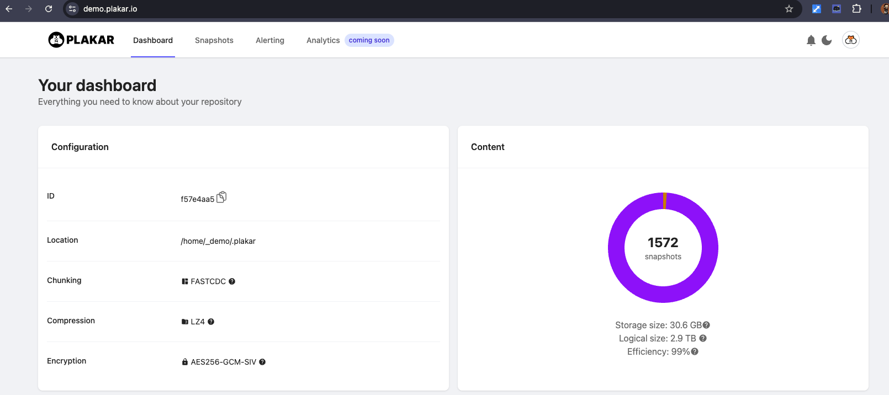
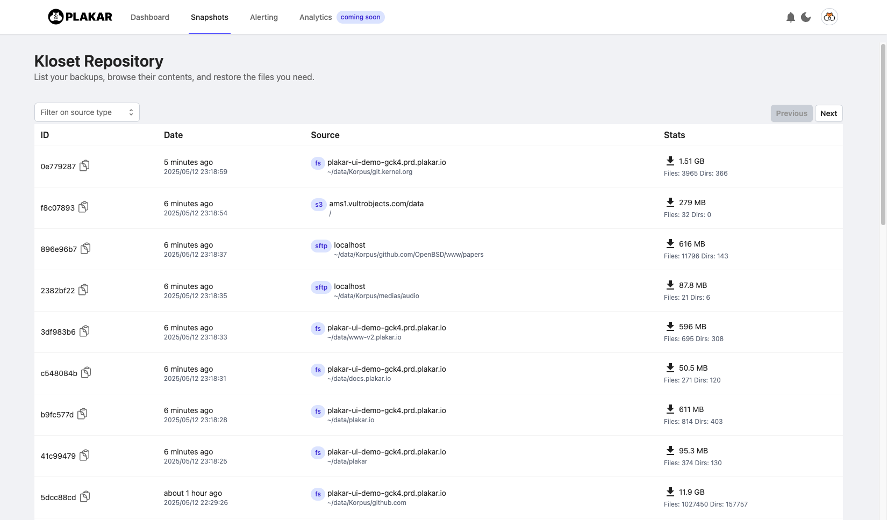
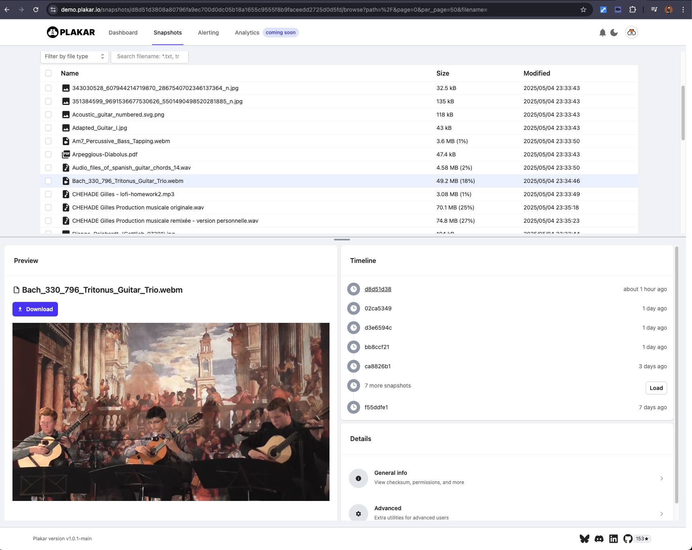
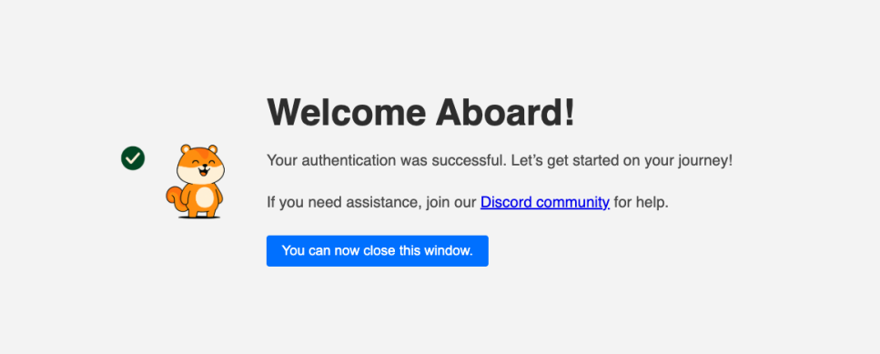
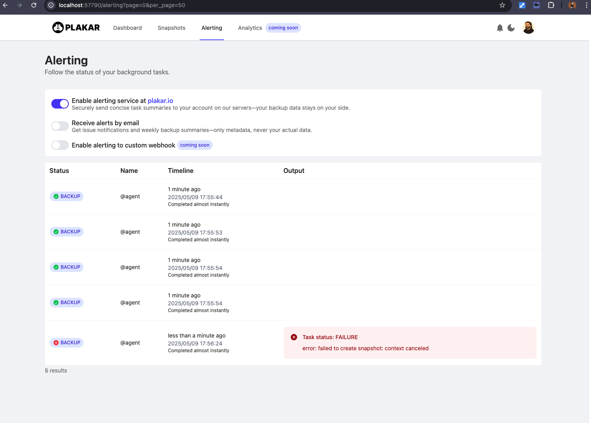

In February,
[we introduced the first plakar beta release](/articles/2025-02-26/plakar-beta-release/) and since then we worked tirelessly to build our first stable release,
improving on user feedback and adding new nice features while at it.

We're now thrilled to announce the **release of Plakar v1.0.1**, marking a major milestone in our journey:
locking in a stable base that empowers us to experiment, expand, and evolve without compromise, while bringing a ton of exciting new features.

Our goal is to set a new open-source standard, we won't settle for less:

Just like everyone agrees that `git` is a go-to solution for code versioning,
that `docker` is a go-to solution for containers,
or that `k8s` is a go-to solution for orchestration...
we want people to recognize `plakar` as a go-to solution for backups.

--- 
## How are you going to achieve that ?

  
  

    To transition from a small project with ideas to a full-fledged business with means,
    Plakar was officially incorporated in September 2024.
     
     
    We’ve since secured a <b>$3 million pre-seed round</b> to fuel our ambitions: assembling the ideal team (which we did.),
    building the most expansive ingestion ecosystem possible, and establishing a new open-source standard.
  

Our optional enterprise-grade features will provide the long-term financing needed to sustain innovation and growth on this journey.

---
## What is Plakar?

Plakar is a next-generation, snapshot-based backup and archiving solution built for today’s data-driven workflows,
built upon [Kloset, our immutable data store](/posts/2025-04-29/kloset-the-immutable-data-store/).

By combining an intuitive snapshot model with a custom virtual filesystem (VFS),
it lets you take fast incremental backups and roam through past versions of your data as easily as browsing files on your desktop.

Whether you’re protecting personal projects or enterprise-scale datasets, Plakar delivers portability, performance, and security without the typical headaches of traditional backup tools.

At its core, Plakar was born out of frustration with legacy solutions that are complex, platform-locked, and painful at handling large or constantly changing data.
It strips away that complexity by:

- **Snapshot Simplicity**: Capture your data state, then only record changes on each run, all with one simple command-line.

- **Portable Archives (.ptar)**: Package a full repository—or just a slice of it—into a single, deduplicated, optionally encrypted file that you can clone, sync, diff, or mount anywhere `plakar` is installed.

- **Flexible Backends**: Write to local disks, SQLite, S3 buckets, SFTP servers, or any other supported storage with a single command.

- **Built-in Encryption**: Protect your backups end-to-end with [audited](/posts/2025-02-28/audit-of-plakar-cryptography/) encryption algorithms so your data stays safe in motion and at rest.

---
## Why Plakar?

Because backups shouldn’t feel like chores or require armies of specialists. Plakar transforms your archives into active, reusable data assets instead of dormant blobs on a tape.
Use snapshots to accelerate AI model training, spin up historical datasets for analytics, or satisfy audit requirements without juggling half a dozen tools.

Key advantages include:

- **Zero-Learning-Curve**: Familiar file commands (backup, restore, cat, ls, diff, sync, ...) work the way you expect.

- **Maximum Portability**: Share a .ptar file with a colleague or migrate a repo across clouds in minutes.

- **Extreme Efficiency**: Deduplication and compression minimize storage costs, even for ever-growing datasets.

- **Open Source & Extensible**: Join a growing community; inspect, customize, or extend Plakar to fit your environment.

And coming soon—**watch for PlaSQL**, our interactive query layer that lets you search for data within archived snapshots like a live database.

---
## Key Features of Plakar v1.0.1

### **Snapshots With Efficient Deduplication**

Quick, incremental, and reliable backups powered by Plakar’s built-in virtual filesystem (VFS) and indexes.

Effortlessly maintain historical versions without redundancy regardless of how many snapshots you take.
A repository can efficiently hold thousands of backups,
you don't have to worry about backing up "too much" or "too frequently":
**more restore points, less space used**.

### **3-2-1 Backups With Alerting Out Of The Box:**
Without the need for other external tool,
**setup right away a 3-2-1 backup strategy**:
backup a local copy,
synchronize to a remote SFTP machine and to Amazon's Glacier in just a couple minutes.
If you want an air-gapped copy,
you can also use our `ptar` archive format to export a repository or portion of it to an offline drive.

If you don't have the instrastructure for alerting,
we also have you covered with our own alerting service provided for free to registered users.

### **Portable Archives (.ptar)**

PTAR is our immutable archive format engineered for effortless transfer, dependable storage, and straightforward restoration across any environment.

It delivers all of `kloset`’s capabilities—deduplication, encryption, and more—in a single, standalone file that cannot be modified once created,
but that can be written to an offline storage or passed to other people.

You can package data from any supported source (filesystem, S3, SFTP, etc.) or from another `kloset` whether it’s to copy an entire repository or just selected snapshots.

After creation, you can use `plakar` to interact with a `.ptar` archive exactly like any other repository (read-only), including through our UI for browsing, searching, and previewing !

### **Multiple Storage Backends**
Flexible support for various storage options, including local disk, SQLite, SFTP, S3, and more—enabling you to adapt Plakar to your existing infrastructure effortlessly.

### **Powerful Data Integrations**
Easily import and export data from multiple sources and to multiple destinations such as FTP and SFTP servers, S3, and others, simplifying data migration and interoperability.

### **Security & Encryption**
Built-in [audited](/posts/2025-02-28/audit-of-plakar-cryptography/) encryption mechanisms ensure robust data protection, maintaining the confidentiality and integrity of your backups, whether stored locally or remotely.

Not only `plakar` uses encryption to protect the data within a repository,
but it also heavily relies on it to maintain integrity,
detect corruption and attempts at altering data by a third-party,
and to some extent hide the knowledge of what kind of data is being backed up.

### **An awesome and snappy UI:**
Use our UI to browsing any kloset repository,
local or remote,
inspect differences,
preview data content before restore,
download parts of the kloset,
etc...

It provides full preview for a wide variety of files,
including PDFs, audios and videos,
without the need to fully restore locally.

### Authentication to our services

If you have your own infra and techies around,
you can use `plakar` fully on-premise and build your tooling without any need to interact with us once the software is installed.

For others,
we will provide a set of additional services and add-ons backed by our infrastructure.
To enable them,
you will need to be logged in so we can tie them to your instance.

Authentication is painless,
no account creation is needed,
you either use `plakar login` on the command line or click on the `login` button on the UI...
which will either prompt for an e-mail so that we can send you an autologin link or use Oauth to authenticate you against one of your identity providers (Github-only for now).

This is by no means a requirement,
and if you don't use our services and add-ons then you are absolutely not required to authenticate or even talk to us.

### Alerting and reporting

Backups is often a set and forget process:
you setup backups and forget about them until you realise you need them and hope they'll work.

Our alerting service allows authenticated users to have their plakar send concise task summaries,
**not actual backup data**,
which we can then monitor to notify them if tasks start failing.

The alerting can be done through the UI,
but optionally an alert can also be sent to the e-mail address that backs their identity:

--- 
## Work In Progress

Now that we have a stable base to build upon,
we will start bringing new storage connectors and data integrations to extend the abilities of `plakar`.

We have lots of plans so I'll only mention a few that will land in an upcoming minor release,
making them available soon.

We will rely on the community to propose new integrations and setup a voting system to prioritize requests.

### Kloset Storage Connectors

#### **Rclone**
An kloset storage connector that uses the [rclone](https://github.com/rclone/rclone) project as **its transport layer**,
allowing `plakar` to host klosets on a variety of popular services.

### Kloset Data Integrations

#### **Stdio**
An integration that imports data from standard input and/or exports data to standard output.
It is suitable to ingest database dumps (ie: `pg_dump`, `mysqldump`, `mongodump`, ...) and restore back to an ingestion tool.

#### **IMAP**
An integration that imports/exports mail from/to an IMAP server.
Suitable to backup your mail server or mail account at your mail provider.

#### **Notion**
An integration that backs up and restores the content of a `notion.so` accounts,
saving your precious data.

#### **Rclone**
An integration that uses the [rclone](https://github.com/rclone/rclone) project as **its transport layer**,
allowing `plakar` to import and export data to several popular services,
including Google Drive, Google Photos, OneDrive, ....

#### **iPhoto**
An integration currently limited to importing photos from iPhoto.
This is a work in progress in early stage despite having a functional proof of concept.

#### **Multi**
The multi integration chains multiple integrations,
allowing to bundle into a single snapshot data coming from several sources,
and restoring them together.

It is intended to cover cases like Wordpress, Joomla, Owncloud, ...
where a backup is both a filesystem (fetched through FTP or SFTP) and a database.
In this scenario,
a multi-integration snapshot would hold both the filesystem and database backup tied together.

---

## What's Next for Plakar ?

We're actively working to enhance Plakar with new features and capabilities.

Our immediate roadmap includes:

- Releasing an SDK so you can easily bring support to new storage and integrations effortlessly.

- Extended support for import/export plugins.

- Enhanced performance and incremental indexing for even faster backups and restores.

- Advanced diffing and snapshot browsing interfaces.

- Dashboards for better visualization of repository content and activity.

- A first batch of enterprise features: snapshots signing, multi-user with ACL support, ...

We value community involvement highly and welcome your ideas, feedback, and contributions. Please join us by participating in GitHub issues, discussions, or our community forums.

--- 

## Community

Get started with Plakar today and become part of our community:

- Try Plakar now with [our quickstart](https://docs.plakar.io/en/quickstart/index.html)

- <a class="github-button" href="https://github.com/buttons/github-buttons" data-color-scheme="no-preference: light; light: light; dark: light;" data-icon="octicon-star" aria-label="Star buttons/github-buttons on GitHub">Star</a> us on Github

- Join our developers and users on [Discord](https://discord.gg/uuegtnF2Q5)

Special thanks to all early users, contributors, and supporters who have helped shape this first release—your involvement has been invaluable!

