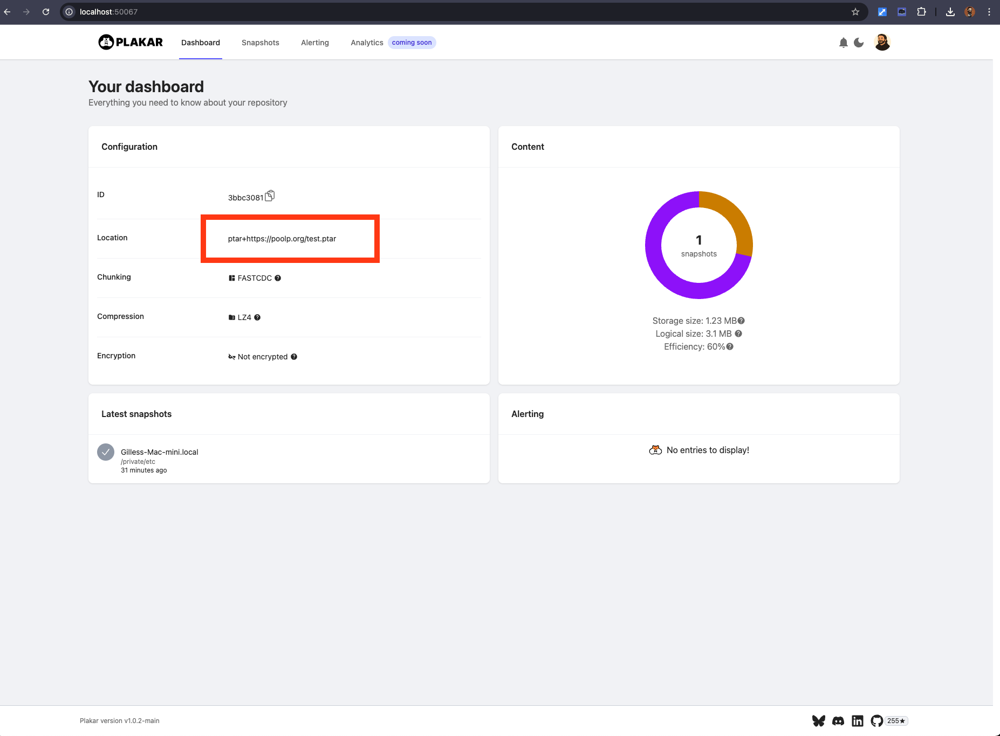
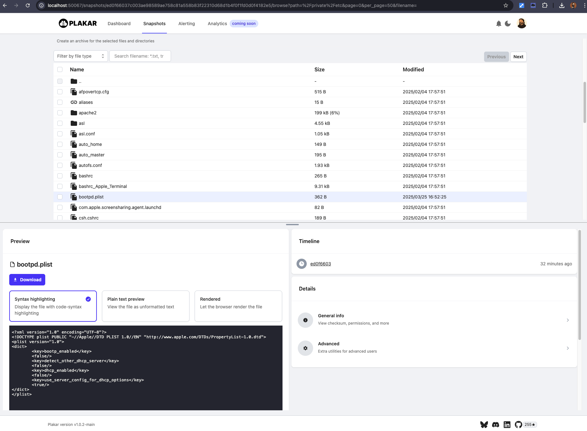
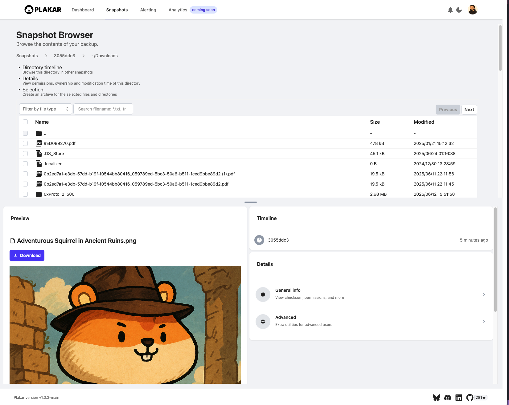

Now that I caught your attention with my mad clickbait skills...
let me explain why this is not complete clickbait, ~~the last reason will surprise you~~ 😊

## TL;DR:
Backup archive formats haven't evolved much since the early days of `.tar` and `.zip`.

They do their job—but they weren't built for deduplication, encryption, or versioned datasets.
Worse, they assume trust in the environment they run in. That's a problem when you're dealing with hybrid infrastructure, compliance requirements, or disaster recovery workflows that need to just work, offline, years from now.

`.ptar` is our answer to that.
It's an archive format designed to encapsulate datasets into a single self-contained, portable, immutable, deduplicated and encrypted file.
Think of it as `.tar` reimagined for zero-trust systems, deduplication, extraction-less fast content access and long-term data integrity.

This post explains what `.ptar` is, why we built it, how it works, and how to use it in practice.

## What Is `.ptar` ?
`.ptar`, pronounced _p-tar_, is an archive format designed to pack groups of resources (directories, files, objects, ...) into a single tamper-evident file (meaning that if it's altered or corrupted, you'll know).

It’s fully self-contained: data, metadata, structure, version history, and cryptographic integrity checks are embedded directly inside the file.
**Of course, it's offline and you don’t need a remote service or a backend of any kind to browse or restore it:**
all you need is an offline `.ptar` reader such as our opensource tool `plakar`.

A `.ptar` file is:

- **Immutable** — write-once, tamper-evident by design.
- **Deduplicated** — content-addressed, chunks are referenced multiple times.
- **Compressed** — post-deduplication compression to save more space.
- **Encrypted** — end-to-end, using same [audited model](/posts/2025-02-28/audit-of-plakar-cryptography/) as underlying Kloset store.
- **Versioned** — supports granular inspection of previous states.
- **Browsable** — via CLI or UI, without full extraction.
- **(Trans)Portable** — works on a USB stick, offline machine, or tape.

If you’ve ever wanted to export a full backup for disaster recovery, legal archiving, or long-term cold storage — and still be able to introspect it years later — that’s exactly what `.ptar` is built for.

If you want to pack multiple assets in a content-addressed immutable file with built-in integrity validation, that's also what `.ptar` is built for.

But if you *just* want to produce a `.tar` or `.zip`-like archive that comes packed with a ton of user-friendly features,
well... it's built for that too 😊

Creating a `.ptar` archive is as simple as the following command:
 
```sh
$ plakar ptar -o test.ptar ~/Downloads
passphrase:
passphrase (confirm): 
$
```

The resulting file contains all of `~/Downloads`,
deduplicated,
compressed,
encrypted
cryptographically authenticated,
easily transportable and immediately usable for restore:


```
$ plakar at test.ptar ls
2025-06-24T20:12:53Z   a2650f13    11 GB        36s /Users/gilles/Downloads

$ plakar at test.ptar restore a2650f13:/
[...]
```


## Background
The `.tar` format has been around since 1979 and the `.zip` format was initially released a decade later, in 1989.
`.tar` only handles data compaction, so it is often coupled with a compression algorithm such as `gzip`, `bzip2`, ...
whereas `.zip` does not split both operations and does both compaction and compression.

Since what really matters here is the compaction,
I'll only mention `.tar` from now on as both are relatively close in terms of how the archive is structured:
more or less a simple stream of entry headers and data.


At the risk of surprising you,
the `.tar` (for **T**ape **AR**chive) format was built for... tape drives,
and was optimized for sequential writes during compaction and sequential reads during extraction.
It was not designed for randomly-accessed, encrypted, content-addressed data or long-term archival at scale.

While sequential access made a lot of sense for tape archiving,
at the risk of surprising you, **again**:
users are not tape drives.


Nowadays, most people don't save to tapes but rather to random-access storages.
They manipulate their archives in a non-sequential pattern extracting them to browse specific files or directory without thinking a second about the order of operations.

So,
not only do they no care about the benefits of sequential I/O patterns for tapes,
but they also miss a ton of nice features that are hard/impossible to obtain with a linear structure,
like for example, deduplication, restore-less browsing, fast searching, ...

Does that mean that `.ptar` is superior to `.tar` ?

Nope, they serve different purposes and target different users, they can be complementary...
though in my daily life using a `.ptar` offers far more benefits.


### A few words about deduplication and compression

Due to its structure and sequential I/O pattern in compaction/decompaction,
`.tar` (and `.zip`, and alike...) can't rely on back-reference tricks to allow deduplication of previously-seen content (at least not without a major change of format).

As a result,
it can't perform deduplication at the file level and even less so at the data level:
any redundant data is duplicated inside the archive.

> It doesn't matter, compression will take care of that !

Yeah, no, it won't.

```sh
$ du -sh ~/Downloads 
 11G    /Users/gilles/Downloads

$ time tar -czf test.tar.gz ~/Downloads
[...] 166.48s user 14.07s system 99% cpu 3:01.53 total
$ du -sh test.tar.gz 
8.8G    test.tar.gz

$ time tar -czf test.tar.gz ~/Downloads ~/Downloads
[...] 332.98s user 28.09s system 99% cpu 6:02.89 total
$ du -sh test.tar.gz                          
 18G    test.tar.gz
$ 

$ time tar -czf test.tar.gz ~/Downloads ~/Downloads ~/Downloads
[...] 499.69s user 41.99s system 99% cpu 9:05.15 total
$ du -sh test.tar.gz                                      
 26G    test.tar.gz
$ 
```

As seen above,
`.tar` is not a dedup-aware archiver and if a file is passed twice, it is archived twice.
The compression doesn't cancel that because compression algorithms use a sliding window that can only "see" so far at a time.
The very common `gzip` used here can only see 32KB,
other algorithms may "see" up to several MB but still...
if the archive is several GB or several TB and the redundancy occurs further than the sliding window,
the compression won't cancel duplicate data.

That topic would require a deep-dive into how compression works,
something a bit off-topic for this article,
but let me know if you're interested in such readings :-)


Anyways,
that's a sharp contrast with `.ptar`:

```sh
$ time plakar ptar -no-encryption -p ~/Downloads test.ptar
[...] 135.80s user 31.42s system 439% cpu 38.073 total
$ du -sh test.ptar
8.2G    test.ptar

$ time plakar ptar -no-encryption -p ~/Downloads -p ~/Downloads test.ptar
[...] 134.91s user 31.09s system 438% cpu 37.892 total
$ du -sh test.ptar                                                     
8.2G    test.ptar
$ 

$ time plakar ptar -no-encryption -p ~/Downloads -p ~/Downloads -p ~/Downloads test.ptar
[...] 134.60s user 30.74s system 438% cpu 37.727 total
$ du -sh test.ptar                                                                    
8.2G    test.ptar
$ 
```

Of course,
I'm showing a `.tar` worst-case scenario here for [dramatic effect](https://www.youtube.com/watch?v=1YgZyLACn6M),
but as you can see even on the very first backup a gain is already visible **when there's redundancy** in the source data:

```
$ ls ~/Downloads|grep '('
update the btree even when the file was found in the cache #272 (1).mp3
update the btree even when the file was found in the cache #272 (2).mp3
```

Being dedup-aware `.ptar` can skip on files it already included,
shrinking the processing time and overall size,
but it can also skip on chunks of files so folders containing a lot of variations of a file with similar parts benefit from this.


Does `.ptar` always generate smaller archives ?

Nope, **not always**, as `.ptar` adds its own overhead to support indexing, integrity checking, etc...
an archive with absolutely no redundancy is going to generate a bigger archive than a plain `.tar`.
However, the overhead is small enough that considering all the features it brings with it, I'd take the overhead anyday:

- ability to serve the archive remotely with random seeks without full download
- a virtal filesystem navigation (mount with fuse, webdav, ...)
- a UI with preview, search and categorization for easy locating of content
- very granular restore and diff-ing at snapshot and file levels
- synchronization capabilities with other klosets...

Technically,
you can host a `.ptar` on any HTTP server that supports range-requests,
and access portions of it from a remote machine without doing a full read,
something just not doable with a `.tar` or `.zip`,
and which proves interesting with large archives for which you only need specific contents:

```
$ plakar at ptar+https://plakar.io/test.ptar ui
```




**Again**, no API, no backend, just a `.ptar` reader that you launch locally,
either through the UI as shown here or through the CLI for some terminal action:

```
$ ./plakar at ptar+https://plakar.io/test.ptar ls
2025-06-02T19:43:53Z   ed0f6603    3.1 MB        0s /private/etc
```


### Encryption

`.zip` supports encryption,
either through a widely supporter legacy algorithm that has shown its weaknesses,
or through strong AES256... that's not supported by all `.zip` readers.

Not much more to say about `.tar` except that it doesn't have any provision for encryption,
the common way to send encrypted tarballs is to use GPG...
and most of us know how that goes with the general public.

Contrast this again with `.ptar` that provides [audited cryptography](/posts/2025-02-28/audit-of-plakar-cryptography/) _by default_,
producing an archive that has inherent MAC integrity check and that can't be altered without validation failing visibily,
but which can also generate plaintext archives for public consumption.


### About these limitations

Most archive tools today layer compression and optional encryption on top, but they still operate on cleartext inputs and offer zero insight into version history, deduplication, or even integrity guarantees without layering custom tooling.

In modern environments—hybrid cloud, air-gapped vaults, regulatory retention—these limitations aren’t just inconvenient, they’re unsafe. If you’re backing up critical infrastructure, you need something that doesn’t leak metadata, doesn’t trust the storage backend, and makes it obvious if anything was **tampered with or silently corrupted** — even a decade later.

`.ptar` was built as part of the Plakar project to solve this.
It combines the Kloset engine’s immutable snapshot model with a transportable archive format: everything you need to restore or audit a backup lives inside a single file. No server dependency. No hidden assumptions.


## `.ptar` vs Traditional Archives

Traditional formats like `.tar` or `.zip` were never meant to handle encrypted, deduplicated, or versioned data.
They operate on raw files, often in-place.
`.ptar` flips that model: encryption comes first, then storage. Everything is content-addressed, immutable, and verifiable without restoring.

Here’s how it stacks up:

| Feature                | ptar                        | tar.gz / zip              |
| ---------------------- | --------------------------- | ------------------------- |
| **Encryption**         | End-to-end (client-side)    | None or bolt-on           |
| **Deduplication**      | Native, content-addressed   | Not supported             |
| **Versioning**         | Snapshot-aware              | Not supported             |
| **Tamper Resistance**  | Cryptographically signed    | No integrity model or simple CRC |
| **Restoration**        | Selective, no extraction    | Full read or extraction required  |
| **Portability**        | Self-contained `.ptar` file | Can require tools (ie: gpg for encryption) |
| **Offline Usability**  | Fully offline, no runtime   | Depends on tooling really |
| **Storage Efficiency** | High (dedup + compression)  | Linear, redundant         |

Bottom line: `.ptar` is built for environments where trust is minimal, bandwidth is constrained, and storage needs to be smart. If you're archiving for compliance or disaster recovery, **it doesn't make sense to wrap modern data in a 1979 format**.
(yeah ! I plugged the catchphrase 💪)

---
## Technical Architecture

A `.ptar` archive is a fully self-contained container.

Internally, it’s structured to preserve everything needed to inspect, verify, and restore one or more Kloset snapshots — even without network access.

At a low level, a `.ptar` consists of:

* **Configuration**: kloset version and parameters for deduplication, compression and encryption.
* **Packfile**: encrypted blobs storing the actual chunked data. These are content-addressed, deduplicated, compressed and encrypted.
* **State**: fast-lookup tables to avoid scanning packfiles during navigation.
* **Footer**: fast-lookup table to locate any PTAR section.

All content inside a `.ptar` is:

* **End-to-end encrypted** using the same encryption keys and schema as live Kloset stores.
* **Integrity-checked** — any corruption or tampering is detectable before extraction.

The archive is designed for **streaming** and **partial access**:

* You can browse contents with a CLI or UI without extracting anything.
* You can extract a single file without reading the entire archive.
* You can pipe it into a remote Plakar instance for restoration or inspection.

This makes `.ptar` not just a backup format — but a reliable container for long-term, verifiable storage that travels with its own integrity guarantees.

---

## Real-World Use Cases

The `.ptar` format isn’t just a theoretical improvement over `.tar.gz`.
It solves concrete problems in modern backup and archival workflows — especially where trust boundaries, compliance, or long-term durability are involved.


### Air-Gapped Backups

Export a `.ptar` archive to USB,
store it in a vault,
and forget about it.

When you need it, everything — metadata, snapshots, file content — is inside, encrypted and verifiable. No runtime, no dependencies, no cloud needed.


### Cold Storage

PTAR is optimized for random reads and high-density archiving. Snapshots remain deduplicated, compressed, and inspectable without restoring the full payload.


### Disaster Recovery

You can generate `.ptar` files as part of your offsite rotation. In a worst-case scenario, restoration is as simple as transferring the archive to a fresh host and running `plakar restore`. No coordination, no external service, no upstream verification required.


### Compliance and Legal Retention

Each `.ptar` is immutable, signed, and traceable. Snapshots inside the archive retain their metadata, timestamp, and audit trail — making PTAR a strong fit for GDPR, HIPAA, and internal data retention policies. It's a legally-verifiable record of state.


### Distribution and Transfer

Need to ship a dataset or backup across environments, air gaps, or legal zones? PTAR packages it up in a single file, preserving structure, permissions, and history. You can hand it over safely, knowing the contents can be validated — but not altered.


## How to Create and Use a PTAR

A `.ptar` builder and reader are implemented into `plakar`, so creating and interacting with archives doesn’t require extra tooling. Everything happens via the CLI.

### Create a `.ptar` from local directories

The following command creates an encrypted snapshot of my `~/Downloads` directory into the file `downloads.ptar`:

```sh
$ plakar ptar -p ~/Downloads downloads.ptar
repository passphrase: 
repository passphrase (confirm): 
$
```

The resulting file has its content deduplicated, compressed, encrypted and is self-verifying. No need to bundle external metadata or config files.


A non-encrypted version can be produced by passing the `-no-encryption` option:

```sh
$ plakar ptar -no-encryption -p ~/Downloads downloads.ptar
$
```

---

### Browse archive contents (no extraction needed)

```bash
$ plakar at downloads.ptar ls
repository passphrase: 
repository passphrase (confirm): 
2025-06-24T00:04:01Z   3055ddc3     12 GB       34s /Users/gilles/Downloads

$ plakar at test.ptar ls 3055ddc3:medias/          
2025-05-03T19:36:29Z drwxr-xr-x   gilles    staff    736 B audio    

$ plakar at test.ptar ls 3055ddc3:medias/audio | grep hiphop
2025-05-03T19:15:39Z -rw-r--r--   gilles    staff   4.6 MB hiphop1.mp3
2025-05-03T19:18:35Z -rw-r--r--   gilles    staff   4.3 MB hiphop2.mp3
$ 
```

This gives you a tree view of all files, snapshot info, timestamps, and version diffs — similar to `ls`, but scoped inside the archive.

Of course you can also use the UI:

```sh
$ plakar at downloads.ptar ui
repository passphrase: 
repository passphrase (confirm):
```




---

### Inspect a single file

```bash
$ plakar at downloads.ptar cat 3055ddc3:dragon.txt
repository passphrase: 
repository passphrase (confirm):

                   ___====-_  _-====___
             _--^^^#####//      \\#####^^^--_
          _-^##########// (    ) \\##########^-_
         -############//  |\^^/|  \\############-
       _/############//   (@::@)   \\############\_
      /#############((     \\//     ))#############\
     -###############\\    (oo)    //###############-
    -#################\\  / "" \  //#################-
   -###################\\/  (_) \/###################-
  _#/|##########/\######(   "/" )######/\##########|\#_
  |/ |#/\#/\#/\/  \#/\##\  ! ' !  /##/\#/  \/\#/\#/\| \
  ||/  V  V '   V  \\#\##\  ~~~  /##/##/  V  '  V  V  \|  
  ||| \ \|  | \|  |  \\#\|     |/##/##/|  |/  | | / / |||
  |||  |_|_|___|_|___|/##\___/##/##/|_|_|__|_|_|  |||
  ||\  .---.  .---.  /###/   \###\  .---.  .---.  /||
   \ | |   | |   | |###/     \###| |   | |   | | /
    \| |   | |   | |#/         \#| |   | |   | |/
     |_|   |_|   |_|             |_|   |_|   |_|

```

Useful for quickly validating what’s in a backup without extracting or restoring the whole archive.             

---

### Restore files from archive

```sh
$ plakar at test.ptar restore -to ./recovery /etc/nginx/nginx.conf 
```

You can restore full trees, single files, or even just metadata. Works offline and doesn’t require a running Plakar server.

---

### Sync into a regular kloset

`.ptar` can also be used as a mean to import data into a regular kloset:

```sh
$ plakar at /var/backups sync from test.ptar
```

This makes it easy to sync or relocate backups between machines, zones, or storage tiers:
you can export some or all snapshots to a `.ptar` archive,
then use that `.ptar` as a sync source for the target machine.

---

Everything about the `.ptar` format is designed for automation and reliability — predictable exit codes, error reporting, and structural validation come built in. It’s safe to run unattended in CI, cron, or recovery scripts.

---

## Security Considerations

`.ptar` is designed for zero-trust environments,
the security model inherits everything from Kloset — with no shortcuts.

### End-to-End Encryption by Default

Every `.ptar` file is encrypted **before** it touches disk.
Encryption happens client-side using authenticated cryptography.
There is no unencrypted intermediate state.

The cryptography is the exact same as that of a regular kloset,
no ptar-specific code was introduced,
meaning that our [Audit of Plakar Cryptography](/posts/2025-02-28/audit-of-plakar-cryptography/) is just as relevant.


### Content-Addressed and Tamper-Evident

All content — files, metadata, manifests — is addressed by cryptographic MAC.
If a single bit is altered (accidentally or maliciously),
the archive fails verification.
`.ptar` doesn’t rely on external checksums or tools — integrity is embedded.


### Signature and Provenance

Snapshots inside a `.ptar`,
as well as the `.ptar` itself,
are **_ready_ for cryptographic signatures**.

That means that once we release signing/verifying support:

* You'll be able to verify *who* created it (with a public key).
* You'll be able to prove *when* it was created (timestamped and non-editable).
* You'll be able to audit what was stored without needing to trust the machine that runs the restore.

This is crucial for legal retention, regulatory compliance, or internal forensics.

### No Server-Side Keys, Ever

PTAR follows a strict **no backend trust** model:

* No key escrow
* No central authority
* No decryption APIs

If you have the archive and the key, you can read it. If not, you can't — period.

### Metadata Privacy

All metadata inside `.ptar` is encrypted. That includes file names, paths, and timestamps. Nothing leaks unless explicitly decrypted. This makes `.ptar` safe for offsite storage, even in hostile environments.

---

If you're archiving sensitive environments — production configs, logs, legal data — `.ptar` ensures the archive is **both safe to store and safe to move**, even across untrusted systems.


## Conclusion

The `.ptar` format was built because we needed to be able to export Kloset stores and traditional archive formats didn't do the job for us.
They weren’t designed for encrypted, deduplicated, or versioned data — and they break down in zero-trust or long-term storage environments.

With `.ptar`,
you get a single file that’s encrypted, immutable, portable, and fully self-contained.
You can inspect it, restore from it, verify it — without needing a running server, a database, or even internet access.
It works offline, across systems, and under stress.

It is more than just a backup format. It’s shaping up to be a foundation for portable, secure data packaging — usable in CI/CD, air-gapped delivery, or regulatory environments where traditional tooling just can’t keep up.

If you're already using Plakar, generating a `.ptar` is one CLI call. If you're building disaster recovery workflows, compliance retention, or cold storage pipelines, `.ptar` gives you a format you can trust — ten years from now, on any machine, without any surprises.

This isn't a better `.tar`, it's a new tool, for a different era.
