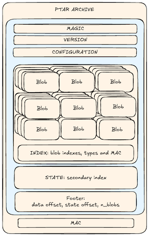

Hi, I’m Julien, co-founder of Plakar.

Before we built this, I spent years as an engineer and later as a manager of infra teams. We handled backups, compliance, and recovery.

In every place, startups, big companies, regulated sectors, I saw the same routine:

```sh
tar -czf archive.tgz /some/folder
```

We all love that command. But in 2025, it can cause trouble.

## What’s changed since `.tgz` was invented

Back when tar came out in 1979 or even gzip came out in 1994, things were simple:

- Data was small, just a few megabytes.
- Storage was local and trusted.
- Versioning was not a big deal.
- Archives ran in one pass, so you had to decompress everything to get one file.

Now none of that fits our needs.

Over the years data grew huge, like terabytes of logs or model checkpoints. We rely on multi‑core work to finish weeks of processing in minutes. We must assume zero trust, so we need proof no one changed anything. Data sits in S3 and other object stores, not on a local disk. We need to track versions and snapshots. And we often want a single file instantly, without waiting for a full decompress.

Plain old `.tgz` was never made for this.

## Why `.tgz` does not work with S3

On a traditional POSIX filesystem, many teams run periodic .tgz snapshots of local disks or NFS shares.
By contrast, S3 buckets are rarely backed up (a rather short-sighted approach for mission-critical cloud data), and even one-off archives are rarely done.

If you want to archive an S3 bucket with `tar` and `gzip`, you:

1. Download everything to your machine (generating storage cost and/or storage cost).
2. Run tar.
3. Maybe encrypt separately.
4. Calculate checksums by hand.
5. Upload back your archive somewhere else.

Then, if you need to prove integrity or restore just one file, you’re stuck. `.tgz` can’t help.
This process is slow, error-prone, and costly. It does not scale to large datasets or S3 buckets.

## What we needed instead

We realized we needed an archive that could:

- remove duplicate data automatically to limit storage and transfer costs
- encrypt by default to protect sensitive data
- store snapshots and history
- check integrity with cryptography
- talk to S3 and other object stores directly
- let you restore parts of an archive on demand

That led us to create Plakar for Backup, it's storage engine Kloset and now `.ptar` the flat file version of Kloset.

## How `.ptar` works

Instead of a simple byte stream, a `.ptar` archive is a self‑contained, content‑addressed container.

Here is what it gives you:

- deduplication: identical chunks stored once, even across snapshots
- built‑in encryption: no extra step
- tamper evidence: any change breaks the archive
- versioning: keep many snapshots easily
- S3 native: one command to archive a bucket
- partial restores and browsing: pick a file without unpacking it all
- fast targeted restores: grab one file in seconds



## A simple example

Suppose I have 11 GB in my Documents and two copies of the same folder:

```sh
$ du -sh ~/Documents
11G     /Users/julien/Documents
$ tar -czf test.tgz ~/Documents ~/Documents
```

Result: about 22 GB compressed.

With `.ptar`:

```sh
$ plakar ptar -plaintext -o test.ptar ~/Documents ~/Documents
```

Result: about 8 GB. Why? `.ptar` sees the duplicate folder once.

In many real-world datasets, a large amount of data is actually redundant: multiple copies, backups, archives, or repeated files across folders. Traditional tools like tar compress everything, even duplicates, which unnecessarily increases the size of the archive. .ptar works differently: it automatically detects and removes duplicates, so each unique chunk is stored only once, no matter how many times it appears. That is why, in the example above, .ptar produces a much smaller archive than .tgz. At large scale, the space savings become significant.
## When `.tgz` still makes sense

I admit, `.tgz` is everywhere:

- It runs almost anywhere, no dependencies.
- It is great for small, throwaway archives.

But when you need trust, speed, and scale, `.ptar` is built for 2025.

## Try `.ptar`

Get the dev build:

```sh
$ go install github.com/PlakarKorp/plakar@v1.0.3-devel.c7a66f1
```

Then:

- archive a folder:
  ```sh
  $ plakar ptar -o backup.ptar ~/Documents
  ```
- archive an S3 bucket:
  ```sh
  $ plakar ptar -o backup.ptar s3://my-bucket
  ```
- list contents:
  ```sh
  $ plakar at backup.ptar ls
  ```
- restore files:
  ```sh
  $ plakar at backup.ptar restore -to ./restore /Documents/config.yaml
  ```
- inspect one file:
  ```sh
  $ plakar at backup.ptar cat snapshotid:/path/to/file
  ```
- mount a UI:
  ```sh
  $ plakar at backup.ptar ui
  ```


## About `.ptar` and Plakar

`.ptar` is part of Plakar, our open‑source backup engine for immutable, deduplicated, and encrypted data. It is in the Plakar CLI today, and soon will ship as a standalone binary if you only need archiving.

The code is open source, so feel free to contribute or give feedback.

`.ptar` and Plakar are doing the biggest difference on datasets with lots of redundancy, such as:
- Backups with multiple versions of the same files or folders
- Email, photo, or document archives containing duplicates
- S3 buckets with snapshots, backups, or files shared across projects
- Scientific datasets or logs where many files are identical or very similar
- Training datasets for machine learning, where many files are duplicated or very similar across different versions or experiments.


## Conclusion

Archiving has changed. Data is bigger, trust is lower, and we want fast access. If you still use `.tgz` for all that, you are taking a risk and wasting time/money.

`.ptar` is not just another tar. It is designed for today’s needs. And this is only the start. We plan more speed, smarter dedupe, standalone binary and smaller metadata.


